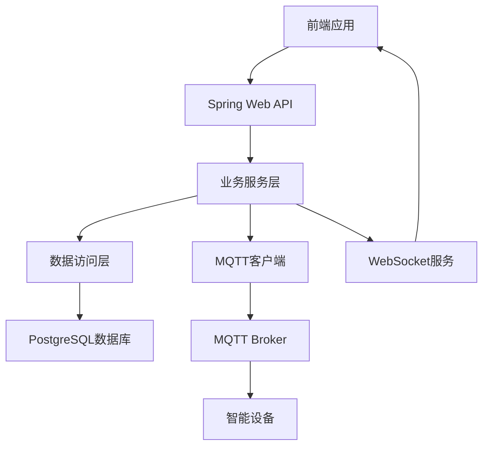

# 宿舍电源管理系统Java重构项目方案文档

## 1. 项目概述

### 1.1 项目背景

宿舍电源管理系统是一个面向高校宿舍的智能电源监控和控制系统，旨在通过物联网技术实现对宿舍用电设备的实时监控、远程控制和智能分析，提高用电安全性和能源利用效率。

现有的后端系统是基于Python FastAPI框架开发的，为了提高系统的性能、可维护性和可扩展性，计划将其重构为基于Java技术栈的实现。

### 1.2 重构目标

- 保持原有功能的完整性和一致性
- 提高系统性能和可靠性
- 增强代码可维护性和可扩展性
- 统一技术栈，便于团队协作
- 为未来功能扩展打下基础

## 2. 现有系统分析

### 2.1 现有系统架构

现有系统采用前后端分离架构：
- 前端：基于Next.js框架的Web应用
- 后端：基于FastAPI框架的Python服务
- 数据库：SQLite（开发环境）或PostgreSQL（生产环境）
- MQTT Broker：用于与设备通信
- WebSocket：用于实时推送

### 2.2 现有系统功能

- **设备管理**：自动注册、列表查询、状态查询、在线状态管理
- **控制功能**：命令下发、冲突检测、状态查询、超时处理
- **数据采集与分析**：遥测数据采集、历史数据查询、AI分析报告
- **实时通信**：WebSocket推送、MQTT通信
- **系统管理**：管理员登录、健康检查

### 2.3 现有系统核心文件

- `main.py`：API接口实现
- `services.py`：业务逻辑实现
- `models.py`：数据模型定义
- `mqtt_bridge.py`：MQTT通信实现
- `ws.py`：WebSocket实现
- `db.py`：数据库连接管理
- `config.py`：配置管理

## 3. Java技术栈设计

### 3.1 技术选型

| 分类 | 技术 | 版本 | 选型理由 |
|------|------|------|----------|
| 基础框架 | Spring Boot | 3.2.x | 提供快速开发、自动配置、内嵌服务器等特性，简化开发流程 |
| Web框架 | Spring Web | 6.1.x | 提供RESTful API支持，与Spring Boot无缝集成 |
| 数据访问 | Spring Data JPA | 3.2.x | 简化数据库操作，提供对象关系映射 |
| 数据库 | PostgreSQL | 15.x | 强大的关系型数据库，支持复杂查询，与现有系统兼容 |
| 实时通信 | Spring WebSocket | 6.1.x | 提供WebSocket支持，实现实时推送 |
| MQTT客户端 | Eclipse Paho MQTT Client | 1.2.5 | 成熟的MQTT客户端库，支持与MQTT Broker通信 |
| 安全框架 | Spring Security | 6.2.x | 提供认证和授权功能，保障系统安全 |
| 依赖管理 | Maven | 3.9.x | 标准化的依赖管理工具，便于项目构建和管理 |
| 日志框架 | Log4j2 | 2.20.x | 高性能、灵活的日志框架 |
| 测试框架 | JUnit 5 + Mockito | 5.9.x + 5.0.x | 提供单元测试和模拟测试支持 |

### 3.2 架构设计

#### 3.2.1 系统架构



#### 3.2.2 分层架构

- **控制器层（Controller）**：处理HTTP请求，调用业务服务，返回响应
- **服务层（Service）**：实现业务逻辑，协调各个组件
- **仓库层（Repository）**：处理数据库操作，提供数据访问接口
- **模型层（Model）**：定义数据结构和实体关系
- **配置层（Config）**：管理系统配置
- **工具层（Util）**：提供通用工具方法

## 4. 项目结构设计

### 4.1 目录结构

```plaintext
├── src/
│   ├── main/
│   │   ├── java/
│   │   │   └── com/
│   │   │       └── dormpower/
│   │   │           ├── DormPowerApplication.java        # 应用入口
│   │   │           ├── config/                          # 配置类
│   │   │           │   ├── AppConfig.java               # 应用配置
│   │   │           │   ├── MqttConfig.java              # MQTT配置
│   │   │           │   ├── SecurityConfig.java          # 安全配置
│   │   │           │   └── WebSocketConfig.java         # WebSocket配置
│   │   │           ├── controller/                      # 控制器
│   │   │           │   ├── AuthController.java          # 认证控制器
│   │   │           │   ├── DeviceController.java        # 设备控制器
│   │   │           │   ├── CommandController.java       # 命令控制器
│   │   │           │   ├── TelemetryController.java     # 遥测数据控制器
│   │   │           │   ├── AiReportController.java      # AI报告控制器
│   │   │           │   └── HealthController.java        # 健康检查控制器
│   │   │           ├── model/                          # 数据模型
│   │   │           │   ├── Device.java                 # 设备模型
│   │   │           │   ├── StripStatus.java            # 插座状态模型
│   │   │           │   ├── Telemetry.java              # 遥测数据模型
│   │   │           │   ├── CommandRecord.java          # 命令记录模型
│   │   │           │   └── UserAccount.java            # 用户账户模型
│   │   │           ├── repository/                     # 数据仓库
│   │   │           │   ├── DeviceRepository.java       # 设备仓库
│   │   │           │   ├── StripStatusRepository.java  # 插座状态仓库
│   │   │           │   ├── TelemetryRepository.java    # 遥测数据仓库
│   │   │           │   ├── CommandRecordRepository.java # 命令记录仓库
│   │   │           │   └── UserAccountRepository.java  # 用户账户仓库
│   │   │           ├── service/                        # 业务服务
│   │   │           │   ├── AuthService.java            # 认证服务
│   │   │           │   ├── DeviceService.java          # 设备服务
│   │   │           │   ├── CommandService.java         # 命令服务
│   │   │           │   ├── TelemetryService.java       # 遥测数据服务
│   │   │           │   ├── AiReportService.java        # AI报告服务
│   │   │           │   ├── MqttService.java            # MQTT服务
│   │   │           │   └── WebSocketService.java       # WebSocket服务
│   │   │           ├── websocket/                      # WebSocket
│   │   │           │   ├── WebSocketHandler.java        # WebSocket处理器
│   │   │           │   └── WebSocketManager.java       # WebSocket连接管理
│   │   │           ├── mqtt/                           # MQTT
│   │   │           │   ├── MqttClient.java             # MQTT客户端
│   │   │           │   └── MqttMessageHandler.java     # MQTT消息处理器
│   │   │           ├── dto/                            # 数据传输对象
│   │   │           │   ├── AuthLoginRequest.java       # 登录请求
│   │   │           │   ├── AuthLoginResponse.java      # 登录响应
│   │   │           │   ├── DeviceResponse.java         # 设备响应
│   │   │           │   ├── StripStatusResponse.java    # 插座状态响应
│   │   │           │   ├── TelemetryResponse.java      # 遥测数据响应
│   │   │           │   ├── CommandRequest.java         # 命令请求
│   │   │           │   ├── CommandResponse.java        # 命令响应
│   │   │           │   └── AiReportResponse.java       # AI报告响应
│   │   │           └── util/                           # 工具类
│   │   │               ├── DateUtil.java               # 日期工具
│   │   │               ├── EncryptionUtil.java         # 加密工具
│   │   │               └── ResponseUtil.java           # 响应工具
│   │   └── resources/
│   │       ├── application.yml                        # 应用配置文件
│   │       └── application-dev.yml                    # 开发环境配置
│   └── test/
│       └── java/
│           └── com/
│               └── dormpower/
│                   ├── controller/                      # 控制器测试
│                   ├── service/                        # 服务测试
│                   └── util/                           # 工具类测试
├── pom.xml                                            # Maven配置文件
└── README.md                                          # 项目说明
```

### 4.2 代码结构说明

- **控制器层**：处理HTTP请求，调用相应的服务方法，返回响应
- **服务层**：实现核心业务逻辑，协调各个组件的交互
- **仓库层**：处理数据库操作，提供CRUD方法
- **模型层**：定义数据库表结构和实体关系
- **DTO层**：定义数据传输对象，用于API请求和响应
- **WebSocket**：处理实时通信，推送设备状态和命令执行结果
- **MQTT**：处理与设备的通信，发送命令和接收设备消息
- **配置层**：管理系统配置，包括数据库连接、MQTT连接等
- **工具层**：提供通用工具方法，如日期处理、加密等

## 5. API接口设计

### 5.1 接口列表

| 接口路径 | 方法 | 功能描述 | 模块 |
|----------|------|----------|------|
| `/health` | GET | 健康检查 | HealthController |
| `/api/auth/login` | POST | 管理员登录 | AuthController |
| `/api/devices` | GET | 获取设备列表 | DeviceController |
| `/api/devices/{deviceId}/status` | GET | 获取设备状态 | DeviceController |
| `/api/telemetry` | GET | 获取遥测数据 | TelemetryController |
| `/api/strips/{deviceId}/cmd` | POST | 下发控制命令 | CommandController |
| `/api/cmd/{cmdId}` | GET | 查询命令状态 | CommandController |
| `/api/rooms/{roomId}/ai_report` | GET | 获取AI分析报告 | AiReportController |
| `/ws` | WebSocket | 实时通信 | WebSocketHandler |

### 5.2 数据模型设计

#### 5.2.1 设备模型（Device）

| 字段名 | 数据类型 | 约束 | 描述 |
|--------|----------|------|------|
| `id` | `String` | `@Id` | 设备唯一标识符 |
| `name` | `String` | `@NotNull` | 设备名称 |
| `room` | `String` | `@NotNull` | 设备所在房间 |
| `online` | `boolean` | `@NotNull` | 设备在线状态 |
| `lastSeenTs` | `long` | `@NotNull` | 设备最后一次通信时间戳 |

#### 5.2.2 插座状态模型（StripStatus）

| 字段名 | 数据类型 | 约束 | 描述 |
|--------|----------|------|------|
| `deviceId` | `String` | `@Id` | 设备ID |
| `ts` | `long` | `@NotNull` | 状态更新时间戳 |
| `online` | `boolean` | `@NotNull` | 设备在线状态 |
| `totalPowerW` | `double` | `@NotNull` | 总功率（瓦） |
| `voltageV` | `double` | `@NotNull` | 电压（伏） |
| `currentA` | `double` | `@NotNull` | 电流（安） |
| `socketsJson` | `String` | `@NotNull` | 各插孔状态的JSON字符串 |

#### 5.2.3 遥测数据模型（Telemetry）

| 字段名 | 数据类型 | 约束 | 描述 |
|--------|----------|------|------|
| `id` | `Long` | `@Id @GeneratedValue` | 遥测数据ID |
| `deviceId` | `String` | `@NotNull @Index` | 设备ID |
| `ts` | `long` | `@NotNull @Index` | 数据采集时间戳 |
| `powerW` | `double` | `@NotNull` | 功率（瓦） |
| `voltageV` | `double` | `@NotNull` | 电压（伏） |
| `currentA` | `double` | `@NotNull` | 电流（安） |

#### 5.2.4 命令记录模型（CommandRecord）

| 字段名 | 数据类型 | 约束 | 描述 |
|--------|----------|------|------|
| `cmdId` | `String` | `@Id` | 命令唯一标识符 |
| `deviceId` | `String` | `@NotNull @Index` | 目标设备ID |
| `socket` | `Integer` | | 目标插孔编号 |
| `action` | `String` | `@NotNull` | 命令动作类型 |
| `payloadJson` | `String` | `@NotNull` | 命令负载的JSON字符串 |
| `state` | `String` | `@NotNull` | 命令执行状态 |
| `message` | `String` | `@NotNull` | 命令执行消息 |
| `createdAt` | `long` | `@NotNull` | 命令创建时间戳 |
| `updatedAt` | `long` | `@NotNull` | 命令更新时间戳 |
| `expiresAt` | `long` | `@NotNull` | 命令过期时间戳 |
| `durationMs` | `Integer` | | 命令执行持续时间（毫秒） |

#### 5.2.5 用户账户模型（UserAccount）

| 字段名 | 数据类型 | 约束 | 描述 |
|--------|----------|------|------|
| `username` | `String` | `@Id` | 用户名 |
| `email` | `String` | `@NotNull @Unique @Index` | 邮箱 |
| `passwordHash` | `String` | `@NotNull` | 密码哈希值 |
| `role` | `String` | `@NotNull` | 用户角色 |
| `resetCodeHash` | `String` | `@NotNull` | 密码重置代码哈希值 |
| `resetExpiresAt` | `long` | `@NotNull` | 密码重置代码过期时间戳 |
| `createdAt` | `long` | `@NotNull` | 账户创建时间戳 |
| `updatedAt` | `long` | `@NotNull` | 账户更新时间戳 |

## 6. 核心功能实现

### 6.1 设备管理

- **设备自动注册**：当设备首次连接时，自动在系统中注册
- **设备列表查询**：提供所有设备的列表信息，包括ID、名称、房间、在线状态等
- **设备状态查询**：查询单个设备的详细状态，包括总功率、电压、电流、各插孔状态等
- **在线状态管理**：自动检测设备在线/离线状态，记录离线原因

### 6.2 控制功能

- **命令下发**：向设备下发控制命令，如开关控制、模式切换等
- **命令冲突检测**：检测并避免同设备的命令冲突
- **命令状态查询**：查询命令的执行状态和结果
- **命令超时处理**：处理设备未及时响应的命令

### 6.3 数据采集与分析

- **遥测数据采集**：采集设备的用电数据，如功率、电压、电流等
- **遥测数据查询**：按不同时间范围查询设备的用电历史数据
- **AI分析报告**：基于历史数据生成用电分析报告，包括摘要、异常和建议

### 6.4 实时通信

- **WebSocket推送**：通过WebSocket推送设备状态、遥测数据和命令执行结果
- **MQTT通信**：与设备通过MQTT协议进行通信

### 6.5 系统管理

- **管理员登录**：提供管理员账号登录功能
- **健康检查**：提供系统健康状态检查接口

## 7. 数据库迁移方案

### 7.1 表结构迁移

- 使用Spring Data JPA的自动建表功能，根据实体类定义自动创建表结构
- 对于现有数据，使用SQL脚本进行迁移

### 7.2 数据迁移

1. **导出现有数据**：从SQLite/PostgreSQL数据库导出数据
2. **转换数据格式**：将数据转换为Java实体类对应的格式
3. **导入数据**：将转换后的数据导入到新的PostgreSQL数据库

### 7.3 迁移工具

- 使用Flyway进行数据库版本管理和迁移
- 编写SQL脚本实现数据迁移

## 8. 迁移策略和实施计划

### 8.1 迁移策略

1. **并行开发**：在保留现有系统的同时，开发Java版本的系统
2. **功能验证**：确保Java版本的系统实现了所有现有功能
3. **数据迁移**：将现有数据迁移到新系统
4. **切换部署**：将生产环境切换到Java版本的系统

### 8.2 实施计划

| 阶段 | 任务 | 时间估计 |
|------|------|----------|
| 1. 准备阶段 | 分析现有系统，设计Java架构 | 1周 |
| 2. 开发阶段 | 实现核心功能，包括API接口、业务逻辑、数据访问等 | 4周 |
| 3. 测试阶段 | 功能测试、性能测试、安全测试 | 2周 |
| 4. 数据迁移 | 导出现有数据，转换格式，导入新系统 | 1周 |
| 5. 部署阶段 | 部署Java版本的系统，切换生产环境 | 1周 |
| 6. 维护阶段 | 监控系统运行，修复问题，优化性能 | 持续 |

### 8.3 风险评估

| 风险点 | 影响 | 应对措施 |
|--------|------|----------|
| 数据迁移失败 | 数据丢失，系统无法正常运行 | 备份现有数据，编写详细的迁移脚本，进行迁移测试 |
| 功能实现不一致 | 系统功能与现有系统不符 | 详细分析现有系统功能，编写测试用例，确保功能一致性 |
| 性能问题 | 系统响应慢，用户体验差 | 优化代码，使用缓存，进行性能测试和调优 |
| 安全漏洞 | 系统被攻击，数据泄露 | 实施安全措施，进行安全测试，及时更新依赖库 |

## 9. 性能优化

### 9.1 数据库优化

- 使用合适的索引
- 优化SQL查询
- 使用连接池
- 定期清理数据

### 9.2 代码优化

- 使用缓存减少数据库查询
- 优化算法和数据结构
- 使用异步处理提高并发性能
- 合理使用线程池

### 9.3 系统优化

- 使用负载均衡
- 水平扩展
- 监控系统性能
- 自动扩容

## 10. 安全考虑

### 10.1 认证与授权

- 使用Spring Security实现认证和授权
- 密码加密存储
- 会话管理
- 权限控制

### 10.2 数据安全

- 使用HTTPS加密传输
- 数据备份和恢复
- 防止SQL注入
- 防止XSS攻击

### 10.3 设备安全

- MQTT认证
- 设备身份验证
- 防止设备被恶意控制

## 11. 总结

本方案文档详细描述了宿舍电源管理系统的Java重构计划，包括技术栈选择、架构设计、项目结构、API接口设计、核心功能实现、数据库迁移方案、迁移策略和实施计划等。

通过Java重构，系统将获得更好的性能、可维护性和可扩展性，为未来的功能扩展打下基础。同时，保持了与现有系统的功能一致性，确保用户体验不受影响。

实施过程中需要注意数据迁移、功能验证和性能优化等关键环节，确保系统的平稳过渡和稳定运行。