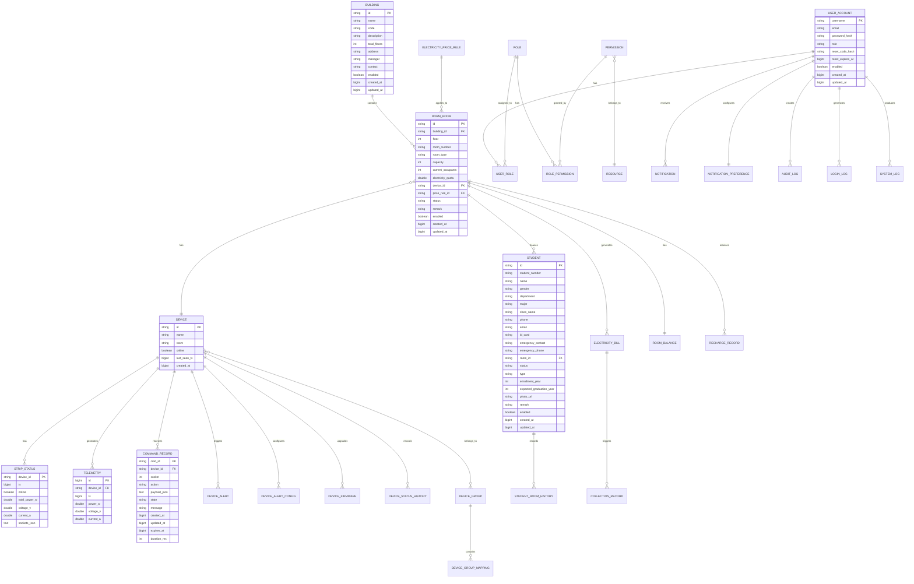

# 宿舍电源管理系统数据库设计文档

## 1. 数据库设计概述

本数据库设计文档详细描述了宿舍电源管理系统的数据库架构，基于Spring Boot + JPA实现，支持SQLite（开发环境）和PostgreSQL（生产环境）两种数据库。

### 1.1 设计目标

- 支持设备管理、状态监控、命令控制、遥测数据采集和AI分析等核心功能
- 提供高效的数据存储和查询能力
- 确保数据的一致性和完整性
- 支持系统的可扩展性和未来功能的扩展
- 支持多租户和权限管理

### 1.2 数据库选择

| 环境 | 数据库 | 说明 |
|------|--------|------|
| 开发环境 | SQLite | 轻量级、无需独立服务器、适合开发和测试 |
| 生产环境 | PostgreSQL | 强大的关系型数据库、支持复杂查询、高并发性能 |

### 1.3 数据表统计

| 分类 | 表数量 | 表名列表 |
|------|--------|----------|
| 设备管理 | 8 | devices, strip_status, telemetry, command_record, device_alerts, device_alert_configs, device_groups, device_group_mappings, device_firmware, device_status_history |
| 宿舍管理 | 4 | buildings, dorm_rooms, students, student_room_history |
| 计费管理 | 5 | electricity_bills, electricity_price_rules, room_balances, recharge_records, collection_record |
| 权限管理 | 5 | user_account, roles, permissions, resources, user_roles, role_permissions |
| 通知管理 | 3 | notifications, notification_preferences, message_template |
| 系统管理 | 7 | system_config, system_logs, system_metrics, data_backups, data_dict, audit_log, login_log, ip_access_control, scheduled_task |

**总计：37张数据表**

## 2. 实体关系图 (ERD)

## 3. 数据表详细设计

### 3.1 设备管理模块

#### 3.1.1 devices（设备表）

存储智能插座设备的基本信息。

| 字段名 | 数据类型 | 约束 | 默认值 | 描述 |
|--------|----------|------|--------|------|
| id | VARCHAR(64) | PRIMARY KEY | - | 设备唯一标识符 |
| name | VARCHAR(128) | NOT NULL | - | 设备名称 |
| room | VARCHAR(64) | NOT NULL | - | 设备所在房间 |
| online | BOOLEAN | NOT NULL | FALSE | 设备在线状态 |
| last_seen_ts | BIGINT | NOT NULL | 0 | 最后心跳时间戳（秒） |
| created_at | BIGINT | NOT NULL | - | 创建时间戳（秒） |

**索引设计：**
| 索引名 | 字段 | 类型 | 描述 |
|--------|------|------|------|
| idx_devices_room | room | 普通索引 | 加速按房间查询设备 |
| idx_devices_online | online | 普通索引 | 加速查询在线/离线设备 |

#### 3.1.2 strip_status（插座状态表）

存储设备的实时状态信息，每个设备一条记录。

| 字段名 | 数据类型 | 约束 | 默认值 | 描述 |
|--------|----------|------|--------|------|
| device_id | VARCHAR(64) | PRIMARY KEY | - | 设备ID，关联devices表 |
| ts | BIGINT | NOT NULL | - | 状态更新时间戳（秒） |
| online | BOOLEAN | NOT NULL | FALSE | 设备在线状态 |
| total_power_w | DOUBLE | NOT NULL | 0.0 | 总功率（瓦） |
| voltage_v | DOUBLE | NOT NULL | 220.0 | 电压（伏） |
| current_a | DOUBLE | NOT NULL | 0.0 | 电流（安） |
| sockets_json | TEXT | NOT NULL | '[]' | 各插孔状态的JSON字符串 |

#### 3.1.3 telemetry（遥测数据表）

存储设备的用电遥测数据，时序数据。

| 字段名 | 数据类型 | 约束 | 默认值 | 描述 |
|--------|----------|------|--------|------|
| id | BIGINT | PRIMARY KEY AUTO_INCREMENT | - | 遥测数据ID |
| device_id | VARCHAR(64) | NOT NULL | - | 设备ID，关联devices表 |
| ts | BIGINT | NOT NULL | - | 数据采集时间戳（秒） |
| power_w | DOUBLE | NOT NULL | 0.0 | 功率（瓦） |
| voltage_v | DOUBLE | NOT NULL | 220.0 | 电压（伏） |
| current_a | DOUBLE | NOT NULL | 0.0 | 电流（安） |

**索引设计：**
| 索引名 | 字段 | 类型 | 描述 |
|--------|------|------|------|
| idx_telemetry_device_id | device_id | 普通索引 | 按设备查询 |
| idx_telemetry_ts | ts | 普通索引 | 按时间查询 |
| idx_telemetry_device_ts | device_id, ts | 复合索引 | 按设备和时间范围查询 |

#### 3.1.4 command_record（命令记录表）

存储设备控制命令的执行记录。

| 字段名 | 数据类型 | 约束 | 默认值 | 描述 |
|--------|----------|------|--------|------|
| cmd_id | VARCHAR(64) | PRIMARY KEY | - | 命令唯一标识符 |
| device_id | VARCHAR(64) | NOT NULL | - | 目标设备ID |
| socket | INTEGER | NULL | - | 目标插孔号（null表示全部） |
| action | VARCHAR(64) | NOT NULL | - | 命令动作类型（on/off/toggle等） |
| payload_json | TEXT | NOT NULL | '{}' | 命令参数JSON |
| state | VARCHAR(16) | NOT NULL | 'pending' | 命令状态（pending/success/failed/timeout） |
| message | VARCHAR(255) | NOT NULL | '' | 执行消息或错误信息 |
| created_at | BIGINT | NOT NULL | - | 创建时间戳（毫秒） |
| updated_at | BIGINT | NOT NULL | - | 更新时间戳（毫秒） |
| expires_at | BIGINT | NOT NULL | - | 过期时间戳（毫秒） |
| duration_ms | INTEGER | NULL | - | 执行耗时（毫秒） |

**索引设计：**
| 索引名 | 字段 | 类型 | 描述 |
|--------|------|------|------|
| idx_cmd_device_id | device_id | 普通索引 | 按设备查询 |
| idx_cmd_state | state | 普通索引 | 按状态查询 |
| idx_cmd_state_expires | state, expires_at | 复合索引 | 查询待处理超时命令 |
| idx_cmd_device_created | device_id, created_at | 复合索引 | 按设备和创建时间查询 |

#### 3.1.5 device_alerts（设备告警表）

存储设备异常告警信息。

| 字段名 | 数据类型 | 约束 | 默认值 | 描述 |
|--------|----------|------|--------|------|
| id | VARCHAR(64) | PRIMARY KEY | - | 告警ID |
| device_id | VARCHAR(64) | NOT NULL | - | 设备ID |
| type | VARCHAR(32) | NOT NULL | - | 告警类型（power/voltage/current/online） |
| level | VARCHAR(16) | NOT NULL | - | 告警级别（info/warning/error/critical） |
| message | VARCHAR(500) | NOT NULL | - | 告警消息 |
| threshold_value | DOUBLE | - | - | 阈值 |
| actual_value | DOUBLE | - | - | 实际值 |
| resolved | BOOLEAN | NOT NULL | FALSE | 是否已解决 |
| ts | BIGINT | NOT NULL | - | 告警时间戳 |
| created_at | BIGINT | NOT NULL | - | 创建时间戳 |
| resolved_at | BIGINT | - | - | 解决时间戳 |

#### 3.1.6 device_alert_configs（设备告警配置表）

存储设备的告警阈值设置。

| 字段名 | 数据类型 | 约束 | 默认值 | 描述 |
|--------|----------|------|--------|------|
| id | VARCHAR(64) | PRIMARY KEY | - | 配置ID |
| device_id | VARCHAR(64) | NOT NULL | - | 设备ID |
| type | VARCHAR(32) | NOT NULL | - | 告警类型 |
| threshold_min | DOUBLE | - | - | 最小阈值 |
| threshold_max | DOUBLE | - | - | 最大阈值 |
| enabled | BOOLEAN | NOT NULL | TRUE | 是否启用 |
| created_at | BIGINT | NOT NULL | - | 创建时间戳 |
| updated_at | BIGINT | NOT NULL | - | 更新时间戳 |

#### 3.1.7 device_groups（设备分组表）

存储设备分组信息，支持层级结构。

| 字段名 | 数据类型 | 约束 | 默认值 | 描述 |
|--------|----------|------|--------|------|
| id | VARCHAR(64) | PRIMARY KEY | - | 分组ID |
| name | VARCHAR(128) | NOT NULL | - | 分组名称 |
| type | VARCHAR(32) | NOT NULL | - | 分组类型（room/floor/building） |
| parent_id | VARCHAR(64) | NOT NULL | '' | 父分组ID |
| created_at | BIGINT | NOT NULL | - | 创建时间戳 |

#### 3.1.8 device_group_mappings（设备分组关联表）

设备和分组的多对多关系。

| 字段名 | 数据类型 | 约束 | 默认值 | 描述 |
|--------|----------|------|--------|------|
| id | VARCHAR(64) | PRIMARY KEY | - | 映射ID |
| device_id | VARCHAR(64) | NOT NULL | - | 设备ID |
| group_id | VARCHAR(64) | NOT NULL | - | 分组ID |
| created_at | BIGINT | NOT NULL | - | 创建时间戳 |

#### 3.1.9 device_firmware（设备固件表）

存储设备固件升级记录。

| 字段名 | 数据类型 | 约束 | 默认值 | 描述 |
|--------|----------|------|--------|------|
| id | BIGINT | PRIMARY KEY AUTO_INCREMENT | - | 固件ID |
| device_id | VARCHAR(50) | NOT NULL | - | 设备ID |
| version | VARCHAR(50) | NOT NULL | - | 固件版本 |
| previous_version | VARCHAR(50) | - | - | 之前版本 |
| file_path | VARCHAR(200) | - | - | 固件文件路径 |
| description | VARCHAR(500) | - | - | 描述 |
| checksum | VARCHAR(64) | - | - | 校验和 |
| file_size | BIGINT | - | - | 文件大小 |
| status | VARCHAR(20) | NOT NULL | 'PENDING' | 状态（PENDING/IN_PROGRESS/COMPLETED/FAILED） |
| progress | INTEGER | - | 0 | 进度百分比 |
| error_message | VARCHAR(500) | - | - | 错误消息 |
| initiated_by | VARCHAR(64) | - | - | 发起人 |
| started_at | BIGINT | - | - | 开始时间 |
| completed_at | BIGINT | - | - | 完成时间 |
| created_at | BIGINT | NOT NULL | - | 创建时间戳 |

**索引设计：**
| 索引名 | 字段 | 类型 | 描述 |
|--------|------|------|------|
| idx_firmware_device | device_id | 普通索引 | 按设备查询 |
| idx_firmware_version | version | 普通索引 | 按版本查询 |

#### 3.1.10 device_status_history（设备状态历史表）

记录设备状态的变更历史。

| 字段名 | 数据类型 | 约束 | 默认值 | 描述 |
|--------|----------|------|--------|------|
| id | VARCHAR(64) | PRIMARY KEY | - | 记录ID |
| device_id | VARCHAR(64) | NOT NULL | - | 设备ID |
| online | BOOLEAN | NOT NULL | - | 在线状态 |
| total_power_w | DOUBLE | - | - | 总功率 |
| voltage_v | DOUBLE | - | - | 电压 |
| current_a | DOUBLE | - | - | 电流 |
| sockets_json | TEXT | - | - | 插孔状态JSON |
| ts | BIGINT | NOT NULL | - | 状态时间戳 |
| created_at | BIGINT | NOT NULL | - | 创建时间戳 |

### 3.2 宿舍管理模块

#### 3.2.1 buildings（楼栋表）

存储楼栋基本信息。

| 字段名 | 数据类型 | 约束 | 默认值 | 描述 |
|--------|----------|------|--------|------|
| id | VARCHAR(64) | PRIMARY KEY | - | 楼栋ID |
| name | VARCHAR(128) | NOT NULL | - | 楼栋名称 |
| code | VARCHAR(32) | NOT NULL | - | 楼栋编号 |
| description | VARCHAR(500) | - | - | 描述 |
| total_floors | INTEGER | - | 0 | 总楼层数 |
| address | VARCHAR(255) | - | - | 地址 |
| manager | VARCHAR(64) | - | - | 管理员 |
| contact | VARCHAR(32) | - | - | 联系电话 |
| enabled | BOOLEAN | NOT NULL | TRUE | 是否启用 |
| created_at | BIGINT | NOT NULL | - | 创建时间戳 |
| updated_at | BIGINT | - | - | 更新时间戳 |

#### 3.2.2 dorm_rooms（宿舍房间表）

存储宿舍房间信息。

| 字段名 | 数据类型 | 约束 | 默认值 | 描述 |
|--------|----------|------|--------|------|
| id | VARCHAR(64) | PRIMARY KEY | - | 房间ID |
| building_id | VARCHAR(64) | NOT NULL | - | 楼栋ID |
| floor | INTEGER | NOT NULL | - | 楼层 |
| room_number | VARCHAR(32) | NOT NULL | - | 房间号 |
| room_type | VARCHAR(32) | - | - | 房间类型（SINGLE/DOUBLE/QUAD） |
| capacity | INTEGER | - | 4 | 容纳人数 |
| current_occupants | INTEGER | - | 0 | 当前入住人数 |
| electricity_quota | DOUBLE | - | 0 | 用电配额（度/月） |
| device_id | VARCHAR(64) | - | - | 关联设备ID |
| price_rule_id | VARCHAR(64) | - | - | 电价规则ID |
| status | VARCHAR(32) | NOT NULL | 'VACANT' | 状态（VACANT/OCCUPIED/MAINTENANCE） |
| remark | VARCHAR(500) | - | - | 备注 |
| enabled | BOOLEAN | NOT NULL | TRUE | 是否启用 |
| created_at | BIGINT | NOT NULL | - | 创建时间戳 |
| updated_at | BIGINT | - | - | 更新时间戳 |

#### 3.2.3 students（学生表）

存储学生/住户信息。

| 字段名 | 数据类型 | 约束 | 默认值 | 描述 |
|--------|----------|------|--------|------|
| id | VARCHAR(64) | PRIMARY KEY | - | 学生ID |
| student_number | VARCHAR(20) | NOT NULL | - | 学号/工号 |
| name | VARCHAR(64) | NOT NULL | - | 姓名 |
| gender | VARCHAR(16) | NOT NULL | - | 性别（MALE/FEMALE） |
| department | VARCHAR(128) | NOT NULL | - | 院系/部门 |
| major | VARCHAR(128) | - | - | 专业 |
| class_name | VARCHAR(64) | - | - | 班级 |
| phone | VARCHAR(20) | - | - | 联系电话 |
| email | VARCHAR(128) | - | - | 邮箱 |
| id_card | VARCHAR(64) | - | - | 身份证号（加密存储） |
| emergency_contact | VARCHAR(64) | - | - | 紧急联系人 |
| emergency_phone | VARCHAR(20) | - | - | 紧急联系电话 |
| room_id | VARCHAR(64) | - | - | 当前入住房间ID |
| status | VARCHAR(32) | NOT NULL | - | 状态（ACTIVE/GRADUATED/SUSPENDED） |
| type | VARCHAR(32) | - | - | 类型（UNDERGRADUATE/POSTGRADUATE/STAFF） |
| enrollment_year | INTEGER | - | - | 入学年份 |
| expected_graduation_year | INTEGER | - | - | 预计毕业年份 |
| photo_url | VARCHAR(255) | - | - | 照片URL |
| remark | VARCHAR(500) | - | - | 备注 |
| enabled | BOOLEAN | NOT NULL | TRUE | 是否启用 |
| created_at | BIGINT | NOT NULL | - | 创建时间戳 |
| updated_at | BIGINT | - | - | 更新时间戳 |

#### 3.2.4 student_room_history（学生入住历史表）

记录学生的入住和退宿历史。

| 字段名 | 数据类型 | 约束 | 默认值 | 描述 |
|--------|----------|------|--------|------|
| id | VARCHAR(64) | PRIMARY KEY | - | 记录ID |
| student_id | VARCHAR(64) | NOT NULL | - | 学生ID |
| room_id | VARCHAR(64) | NOT NULL | - | 房间ID |
| check_in_date | BIGINT | NOT NULL | - | 入住日期 |
| check_out_date | BIGINT | - | - | 退宿日期 |
| status | VARCHAR(32) | NOT NULL | - | 状态（ACTIVE/CHECKED_OUT） |
| check_in_reason | VARCHAR(255) | - | - | 入住原因 |
| check_out_reason | VARCHAR(255) | - | - | 退宿原因 |
| operator | VARCHAR(64) | - | - | 操作员 |
| electricity_usage | DOUBLE | - | 0 | 期间用电量 |
| electricity_cost | DOUBLE | - | 0 | 期间电费 |
| remark | VARCHAR(500) | - | - | 备注 |
| created_at | BIGINT | NOT NULL | - | 创建时间戳 |

### 3.3 计费管理模块

#### 3.3.1 electricity_bills（电费账单表）

存储电费账单信息。

| 字段名 | 数据类型 | 约束 | 默认值 | 描述 |
|--------|----------|------|--------|------|
| id | VARCHAR(64) | PRIMARY KEY | - | 账单ID |
| room_id | VARCHAR(64) | NOT NULL | - | 房间ID |
| period | VARCHAR(16) | NOT NULL | - | 账单周期（如2024-01） |
| total_consumption | DOUBLE | NOT NULL | 0 | 总用电量（度） |
| total_amount | DOUBLE | NOT NULL | 0 | 总金额（元） |
| peak_consumption | DOUBLE | - | - | 峰时用电量 |
| peak_amount | DOUBLE | - | - | 峰时电费 |
| valley_consumption | DOUBLE | - | - | 谷时用电量 |
| valley_amount | DOUBLE | - | - | 谷时电费 |
| flat_consumption | DOUBLE | - | - | 平时用电量 |
| flat_amount | DOUBLE | - | - | 平时电费 |
| status | VARCHAR(32) | NOT NULL | 'PENDING' | 状态（PENDING/PAID/OVERDUE） |
| paid_at | BIGINT | - | - | 缴费时间 |
| payment_method | VARCHAR(32) | - | - | 缴费方式（CASH/WECHAT/ALIPAY） |
| transaction_id | VARCHAR(64) | - | - | 交易流水号 |
| start_date | BIGINT | NOT NULL | - | 账单开始日期 |
| end_date | BIGINT | NOT NULL | - | 账单结束日期 |
| created_at | BIGINT | NOT NULL | - | 创建时间戳 |
| updated_at | BIGINT | - | - | 更新时间戳 |

#### 3.3.2 electricity_price_rules（电价规则表）

支持阶梯电价和时段电价。

| 字段名 | 数据类型 | 约束 | 默认值 | 描述 |
|--------|----------|------|--------|------|
| id | VARCHAR(64) | PRIMARY KEY | - | 规则ID |
| name | VARCHAR(128) | NOT NULL | - | 规则名称 |
| type | VARCHAR(32) | NOT NULL | - | 规则类型（TIER/TIME/MIXED） |
| description | VARCHAR(500) | - | - | 规则描述 |
| base_price | DOUBLE | NOT NULL | - | 基础电价（元/度） |
| tier1_price | DOUBLE | - | - | 第一阶梯电价 |
| tier1_limit | DOUBLE | - | - | 第一阶梯上限（度） |
| tier2_price | DOUBLE | - | - | 第二阶梯电价 |
| tier2_limit | DOUBLE | - | - | 第二阶梯上限（度） |
| tier3_price | DOUBLE | - | - | 第三阶梯电价 |
| peak_price | DOUBLE | - | - | 峰时电价 |
| valley_price | DOUBLE | - | - | 谷时电价 |
| flat_price | DOUBLE | - | - | 平时电价 |
| peak_start_hour | INTEGER | - | - | 峰时开始时间（0-23） |
| peak_end_hour | INTEGER | - | - | 峰时结束时间（0-23） |
| valley_start_hour | INTEGER | - | - | 谷时开始时间（0-23） |
| valley_end_hour | INTEGER | - | - | 谷时结束时间（0-23） |
| enabled | BOOLEAN | NOT NULL | TRUE | 是否启用 |
| created_at | BIGINT | NOT NULL | - | 创建时间戳 |
| updated_at | BIGINT | - | - | 更新时间戳 |

#### 3.3.3 room_balances（房间余额表）

存储房间电费余额信息。

| 字段名 | 数据类型 | 约束 | 默认值 | 描述 |
|--------|----------|------|--------|------|
| id | VARCHAR(64) | PRIMARY KEY | - | 记录ID |
| room_id | VARCHAR(64) | NOT NULL | - | 房间ID |
| balance | DOUBLE | NOT NULL | 0 | 当前余额 |
| total_recharged | DOUBLE | NOT NULL | 0 | 累计充值金额 |
| total_consumed | DOUBLE | NOT NULL | 0 | 累计消费金额 |
| warning_threshold | DOUBLE | - | - | 余额预警阈值 |
| warning_sent | BOOLEAN | - | FALSE | 是否已发送预警 |
| auto_cutoff | BOOLEAN | - | FALSE | 是否自动断电 |
| last_recharge_at | BIGINT | NOT NULL | 0 | 最后充值时间 |
| last_consumption_at | BIGINT | NOT NULL | 0 | 最后消费时间 |
| created_at | BIGINT | NOT NULL | - | 创建时间戳 |
| updated_at | BIGINT | - | - | 更新时间戳 |

#### 3.3.4 recharge_records（充值记录表）

存储房间充值记录。

| 字段名 | 数据类型 | 约束 | 默认值 | 描述 |
|--------|----------|------|--------|------|
| id | VARCHAR(64) | PRIMARY KEY | - | 记录ID |
| room_id | VARCHAR(64) | NOT NULL | - | 房间ID |
| amount | DOUBLE | NOT NULL | - | 充值金额 |
| balance_before | DOUBLE | NOT NULL | - | 充值前余额 |
| balance_after | DOUBLE | NOT NULL | - | 充值后余额 |
| payment_method | VARCHAR(32) | NOT NULL | - | 支付方式（CASH/WECHAT/ALIPAY） |
| transaction_id | VARCHAR(64) | - | - | 第三方交易号 |
| status | VARCHAR(32) | NOT NULL | - | 状态（SUCCESS/FAILED/PENDING） |
| operator | VARCHAR(64) | - | - | 操作员 |
| remark | VARCHAR(500) | - | - | 备注 |
| created_at | BIGINT | NOT NULL | - | 创建时间戳 |

#### 3.3.5 collection_record（催缴记录表）

存储账单催缴记录。

| 字段名 | 数据类型 | 约束 | 默认值 | 描述 |
|--------|----------|------|--------|------|
| id | BIGINT | PRIMARY KEY AUTO_INCREMENT | - | 记录ID |
| room_id | VARCHAR(50) | NOT NULL | - | 房间ID |
| bill_id | VARCHAR(50) | NOT NULL | - | 账单ID |
| student_id | VARCHAR(50) | - | - | 学生ID |
| type | VARCHAR(50) | NOT NULL | - | 催缴类型 |
| channel | VARCHAR(50) | NOT NULL | - | 催缴渠道（SMS/EMAIL/SYSTEM） |
| recipient | VARCHAR(200) | - | - | 接收人 |
| content | TEXT | - | - | 催缴内容 |
| status | VARCHAR(20) | NOT NULL | - | 状态（PENDING/SENT/FAILED） |
| error_message | VARCHAR(500) | - | - | 错误消息 |
| retry_count | INTEGER | - | 0 | 重试次数 |
| max_retry | INTEGER | - | 3 | 最大重试次数 |
| scheduled_ts | BIGINT | - | - | 计划发送时间 |
| sent_ts | BIGINT | - | - | 实际发送时间 |
| created_at | BIGINT | NOT NULL | - | 创建时间戳 |
| updated_at | BIGINT | NOT NULL | - | 更新时间戳 |

**索引设计：**
| 索引名 | 字段 | 类型 | 描述 |
|--------|------|------|------|
| idx_collection_room | room_id | 普通索引 | 按房间查询 |
| idx_collection_bill | bill_id | 普通索引 | 按账单查询 |
| idx_collection_ts | created_at | 普通索引 | 按时间查询 |

### 3.4 权限管理模块

#### 3.4.1 user_account（用户账号表）

存储系统用户账号信息。

| 字段名 | 数据类型 | 约束 | 默认值 | 描述 |
|--------|----------|------|--------|------|
| username | VARCHAR(64) | PRIMARY KEY | - | 用户名 |
| email | VARCHAR(128) | NOT NULL UNIQUE | - | 邮箱 |
| password_hash | VARCHAR(255) | NOT NULL | - | 密码哈希 |
| role | VARCHAR(16) | NOT NULL | 'user' | 用户角色 |
| reset_code_hash | VARCHAR(255) | NOT NULL | '' | 密码重置码哈希 |
| reset_expires_at | BIGINT | NOT NULL | 0 | 重置码过期时间戳 |
| enabled | BOOLEAN | NOT NULL | TRUE | 是否启用 |
| created_at | BIGINT | NOT NULL | - | 创建时间戳 |
| updated_at | BIGINT | NOT NULL | - | 更新时间戳 |

**索引设计：**
| 索引名 | 字段 | 类型 | 描述 |
|--------|------|------|------|
| idx_email | email | 唯一索引 | 按邮箱查询用户 |

#### 3.4.2 roles（角色表）

存储角色信息。

| 字段名 | 数据类型 | 约束 | 默认值 | 描述 |
|--------|----------|------|--------|------|
| id | VARCHAR(64) | PRIMARY KEY | - | 角色ID |
| code | VARCHAR(64) | NOT NULL UNIQUE | - | 角色编码 |
| name | VARCHAR(128) | NOT NULL | - | 角色名称 |
| description | VARCHAR(500) | - | - | 角色描述 |
| enabled | BOOLEAN | NOT NULL | TRUE | 是否启用 |
| system | BOOLEAN | NOT NULL | FALSE | 是否系统角色 |
| created_at | BIGINT | NOT NULL | - | 创建时间戳 |
| updated_at | BIGINT | NOT NULL | - | 更新时间戳 |

**索引设计：**
| 索引名 | 字段 | 类型 | 描述 |
|--------|------|------|------|
| idx_role_code | code | 唯一索引 | 按编码查询角色 |

#### 3.4.3 permissions（权限表）

存储权限信息。

| 字段名 | 数据类型 | 约束 | 默认值 | 描述 |
|--------|----------|------|--------|------|
| id | VARCHAR(64) | PRIMARY KEY | - | 权限ID |
| code | VARCHAR(128) | NOT NULL UNIQUE | - | 权限编码 |
| name | VARCHAR(128) | NOT NULL | - | 权限名称 |
| description | VARCHAR(500) | - | - | 权限描述 |
| resource_id | VARCHAR(64) | NOT NULL | - | 资源ID |
| action | VARCHAR(32) | NOT NULL | - | 操作类型（CREATE/READ/UPDATE/DELETE） |
| enabled | BOOLEAN | NOT NULL | TRUE | 是否启用 |
| created_at | BIGINT | NOT NULL | - | 创建时间戳 |
| updated_at | BIGINT | NOT NULL | - | 更新时间戳 |

**索引设计：**
| 索引名 | 字段 | 类型 | 描述 |
|--------|------|------|------|
| idx_permission_code | code | 唯一索引 | 按编码查询权限 |

#### 3.4.4 resources（资源表）

存储系统资源信息。

| 字段名 | 数据类型 | 约束 | 默认值 | 描述 |
|--------|----------|------|--------|------|
| id | VARCHAR(64) | PRIMARY KEY | - | 资源ID |
| code | VARCHAR(128) | NOT NULL UNIQUE | - | 资源编码 |
| name | VARCHAR(128) | NOT NULL | - | 资源名称 |
| description | VARCHAR(500) | - | - | 资源描述 |
| type | VARCHAR(32) | NOT NULL | - | 资源类型（MENU/BUTTON/API） |
| url | VARCHAR(255) | - | - | 资源URL |
| method | VARCHAR(16) | - | - | HTTP方法 |
| parent_id | BIGINT | NOT NULL | 0 | 父资源ID |
| sort_order | INTEGER | NOT NULL | 0 | 排序号 |
| enabled | BOOLEAN | NOT NULL | TRUE | 是否启用 |
| created_at | BIGINT | NOT NULL | - | 创建时间戳 |
| updated_at | BIGINT | NOT NULL | - | 更新时间戳 |

**索引设计：**
| 索引名 | 字段 | 类型 | 描述 |
|--------|------|------|------|
| idx_resource_code | code | 唯一索引 | 按编码查询资源 |

#### 3.4.5 user_roles（用户角色关联表）

用户和角色的多对多关系。

| 字段名 | 数据类型 | 约束 | 默认值 | 描述 |
|--------|----------|------|--------|------|
| username | VARCHAR(64) | PRIMARY KEY | - | 用户名 |
| role_id | VARCHAR(64) | PRIMARY KEY | - | 角色ID |
| assigned_at | BIGINT | NOT NULL | - | 分配时间戳 |
| assigned_by | VARCHAR(64) | - | - | 分配人 |

**索引设计：**
| 索引名 | 字段 | 类型 | 描述 |
|--------|------|------|------|
| idx_user_roles_user | username | 普通索引 | 按用户查询角色 |
| idx_user_roles_role | role_id | 普通索引 | 按角色查询用户 |
| uk_user_role | username, role_id | 唯一约束 | 防止重复分配 |

#### 3.4.6 role_permissions（角色权限关联表）

角色和权限的多对多关系。

| 字段名 | 数据类型 | 约束 | 默认值 | 描述 |
|--------|----------|------|--------|------|
| role_id | VARCHAR(64) | PRIMARY KEY | - | 角色ID |
| permission_id | VARCHAR(64) | PRIMARY KEY | - | 权限ID |

### 3.5 通知管理模块

#### 3.5.1 notifications（通知表）

存储系统通知信息。

| 字段名 | 数据类型 | 约束 | 默认值 | 描述 |
|--------|----------|------|--------|------|
| id | BIGINT | PRIMARY KEY AUTO_INCREMENT | - | 通知ID |
| title | VARCHAR(255) | NOT NULL | - | 通知标题 |
| content | TEXT | NOT NULL | - | 通知内容 |
| type | VARCHAR(32) | NOT NULL | - | 通知类型 |
| username | VARCHAR(64) | - | - | 接收用户名 |
| is_read | BOOLEAN | - | FALSE | 是否已读 |
| priority | VARCHAR(16) | - | 'NORMAL' | 优先级（LOW/NORMAL/HIGH/URGENT） |
| source | VARCHAR(64) | - | - | 来源 |
| source_id | VARCHAR(64) | - | - | 来源ID |
| created_at | TIMESTAMP | - | - | 创建时间 |
| read_at | TIMESTAMP | - | - | 阅读时间 |

#### 3.5.2 notification_preferences（通知偏好设置表）

存储用户通知偏好设置。

| 字段名 | 数据类型 | 约束 | 默认值 | 描述 |
|--------|----------|------|--------|------|
| id | BIGINT | PRIMARY KEY AUTO_INCREMENT | - | 设置ID |
| username | VARCHAR(64) | NOT NULL UNIQUE | - | 用户名 |
| email_enabled | BOOLEAN | NOT NULL | TRUE | 是否启用邮件通知 |
| system_enabled | BOOLEAN | NOT NULL | TRUE | 是否启用系统通知 |
| alert_enabled | BOOLEAN | NOT NULL | TRUE | 是否启用告警通知 |
| billing_enabled | BOOLEAN | NOT NULL | TRUE | 是否启用账单通知 |
| maintenance_enabled | BOOLEAN | NOT NULL | TRUE | 是否启用维护通知 |
| quiet_hours_enabled | BOOLEAN | NOT NULL | FALSE | 是否启用免打扰 |
| quiet_hours_start | VARCHAR(8) | - | '22:00' | 免打扰开始时间 |
| quiet_hours_end | VARCHAR(8) | - | '08:00' | 免打扰结束时间 |
| alert_level | VARCHAR(16) | NOT NULL | 'warning' | 告警级别阈值 |
| created_at | BIGINT | NOT NULL | - | 创建时间戳 |
| updated_at | BIGINT | NOT NULL | - | 更新时间戳 |

**索引设计：**
| 索引名 | 字段 | 类型 | 描述 |
|--------|------|------|------|
| idx_notification_pref_user | username | 唯一索引 | 按用户查询偏好 |

#### 3.5.3 message_template（消息模板表）

存储消息模板。

| 字段名 | 数据类型 | 约束 | 默认值 | 描述 |
|--------|----------|------|--------|------|
| id | BIGINT | PRIMARY KEY AUTO_INCREMENT | - | 模板ID |
| template_code | VARCHAR(50) | NOT NULL UNIQUE | - | 模板编码 |
| type | VARCHAR(50) | NOT NULL | - | 模板类型 |
| name | VARCHAR(100) | NOT NULL | - | 模板名称 |
| subject | VARCHAR(200) | - | - | 邮件主题 |
| content | TEXT | - | - | 纯文本内容 |
| html_content | TEXT | - | - | HTML内容 |
| channel | VARCHAR(50) | - | - | 发送渠道（EMAIL/SMS/SYSTEM） |
| variables | VARCHAR(500) | - | - | 变量列表JSON |
| enabled | BOOLEAN | - | TRUE | 是否启用 |
| is_system | BOOLEAN | - | FALSE | 是否系统模板 |
| created_at | BIGINT | NOT NULL | - | 创建时间戳 |
| updated_at | BIGINT | NOT NULL | - | 更新时间戳 |

**索引设计：**
| 索引名 | 字段 | 类型 | 描述 |
|--------|------|------|------|
| idx_template_code | template_code | 唯一索引 | 按编码查询模板 |
| idx_template_type | type | 普通索引 | 按类型查询模板 |

### 3.6 系统管理模块

#### 3.6.1 system_config（系统配置表）

存储系统配置项。

| 字段名 | 数据类型 | 约束 | 默认值 | 描述 |
|--------|----------|------|--------|------|
| id | BIGINT | PRIMARY KEY AUTO_INCREMENT | - | 配置ID |
| config_key | VARCHAR(128) | NOT NULL UNIQUE | - | 配置键 |
| config_value | TEXT | NOT NULL | - | 配置值 |
| description | VARCHAR(500) | - | - | 配置描述 |
| category | VARCHAR(64) | - | - | 配置分类 |
| is_editable | BOOLEAN | - | TRUE | 是否可编辑 |
| created_at | TIMESTAMP | - | - | 创建时间 |
| updated_at | TIMESTAMP | - | - | 更新时间 |

#### 3.6.2 system_logs（系统日志表）

存储系统运行日志。

| 字段名 | 数据类型 | 约束 | 默认值 | 描述 |
|--------|----------|------|--------|------|
| id | BIGINT | PRIMARY KEY AUTO_INCREMENT | - | 日志ID |
| log_level | VARCHAR(16) | NOT NULL | - | 日志级别（DEBUG/INFO/WARN/ERROR） |
| log_type | VARCHAR(32) | NOT NULL | - | 日志类型 |
| message | TEXT | NOT NULL | - | 日志消息 |
| source | VARCHAR(128) | - | - | 日志来源 |
| username | VARCHAR(64) | - | - | 操作用户 |
| ip_address | VARCHAR(64) | - | - | IP地址 |
| user_agent | TEXT | - | - | 用户代理 |
| details | TEXT | - | - | 详细信息JSON |
| created_at | TIMESTAMP | - | - | 创建时间 |

#### 3.6.3 system_metrics（系统监控指标表）

存储系统监控指标数据。

| 字段名 | 数据类型 | 约束 | 默认值 | 描述 |
|--------|----------|------|--------|------|
| id | BIGINT | PRIMARY KEY AUTO_INCREMENT | - | 指标ID |
| metric_type | VARCHAR(32) | NOT NULL | - | 指标类型 |
| metric_name | VARCHAR(128) | NOT NULL | - | 指标名称 |
| metric_value | DOUBLE | NOT NULL | - | 指标值 |
| metric_unit | VARCHAR(32) | - | - | 指标单位 |
| details | TEXT | - | - | 详细信息JSON |
| created_at | TIMESTAMP | - | - | 创建时间 |

#### 3.6.4 data_backups（数据备份表）

存储数据备份记录。

| 字段名 | 数据类型 | 约束 | 默认值 | 描述 |
|--------|----------|------|--------|------|
| id | BIGINT | PRIMARY KEY AUTO_INCREMENT | - | 备份ID |
| backup_name | VARCHAR(128) | NOT NULL | - | 备份名称 |
| backup_type | VARCHAR(32) | NOT NULL | - | 备份类型（FULL/INCREMENTAL） |
| file_path | VARCHAR(255) | NOT NULL | - | 备份文件路径 |
| file_size | BIGINT | - | - | 文件大小（字节） |
| description | VARCHAR(500) | - | - | 备份描述 |
| status | VARCHAR(32) | NOT NULL | 'PENDING' | 状态（PENDING/COMPLETED/FAILED） |
| created_by | VARCHAR(64) | - | - | 创建人 |
| created_at | TIMESTAMP | - | - | 创建时间 |
| completed_at | TIMESTAMP | - | - | 完成时间 |

#### 3.6.5 data_dict（数据字典表）

存储数据字典。

| 字段名 | 数据类型 | 约束 | 默认值 | 描述 |
|--------|----------|------|--------|------|
| id | BIGINT | PRIMARY KEY AUTO_INCREMENT | - | 字典ID |
| dict_type | VARCHAR(50) | NOT NULL | - | 字典类型 |
| dict_code | VARCHAR(50) | NOT NULL UNIQUE | - | 字典编码 |
| dict_label | VARCHAR(100) | NOT NULL | - | 字典标签 |
| dict_value | VARCHAR(200) | - | - | 字典值 |
| parent_code | VARCHAR(50) | - | - | 父级编码 |
| sort | INTEGER | - | 0 | 排序号 |
| description | VARCHAR(500) | - | - | 描述 |
| enabled | BOOLEAN | - | TRUE | 是否启用 |
| is_default | BOOLEAN | - | FALSE | 是否默认 |
| css_class | VARCHAR(64) | - | - | CSS类名 |
| list_class | VARCHAR(64) | - | - | 列表样式 |
| is_system | BOOLEAN | - | FALSE | 是否系统字典 |
| created_at | BIGINT | NOT NULL | - | 创建时间戳 |
| updated_at | BIGINT | NOT NULL | - | 更新时间戳 |

**索引设计：**
| 索引名 | 字段 | 类型 | 描述 |
|--------|------|------|------|
| idx_dict_type | dict_type | 普通索引 | 按类型查询字典 |
| idx_dict_code | dict_code | 唯一索引 | 按编码查询字典 |

#### 3.6.6 audit_log（审计日志表）

存储操作审计日志。

| 字段名 | 数据类型 | 约束 | 默认值 | 描述 |
|--------|----------|------|--------|------|
| id | BIGINT | PRIMARY KEY AUTO_INCREMENT | - | 日志ID |
| username | VARCHAR(50) | NOT NULL | - | 操作用户 |
| module | VARCHAR(50) | NOT NULL | - | 操作模块 |
| action | VARCHAR(50) | NOT NULL | - | 操作类型 |
| target | VARCHAR(200) | - | - | 操作目标 |
| target_type | VARCHAR(100) | - | - | 目标类型 |
| target_id | VARCHAR(100) | - | - | 目标ID |
| ip_address | VARCHAR(100) | - | - | IP地址 |
| user_agent | VARCHAR(500) | - | - | 用户代理 |
| request_method | TEXT | - | - | 请求方法 |
| request_url | TEXT | - | - | 请求URL |
| request_params | TEXT | - | - | 请求参数 |
| request_body | TEXT | - | - | 请求体 |
| response_data | TEXT | - | - | 响应数据 |
| status | VARCHAR(20) | NOT NULL | - | 操作状态（SUCCESS/FAILURE） |
| message | VARCHAR(500) | - | - | 操作消息 |
| ts | BIGINT | - | - | 操作时间戳 |
| duration | BIGINT | - | - | 执行时长（毫秒） |
| trace_id | VARCHAR(64) | - | - | 追踪ID |

**索引设计：**
| 索引名 | 字段 | 类型 | 描述 |
|--------|------|------|------|
| idx_audit_username | username | 普通索引 | 按用户查询 |
| idx_audit_ts | ts | 普通索引 | 按时间查询 |
| idx_audit_module | module | 普通索引 | 按模块查询 |
| idx_audit_action | action | 普通索引 | 按操作查询 |

#### 3.6.7 login_log（登录日志表）

存储用户登录日志。

| 字段名 | 数据类型 | 约束 | 默认值 | 描述 |
|--------|----------|------|--------|------|
| id | BIGINT | PRIMARY KEY AUTO_INCREMENT | - | 日志ID |
| username | VARCHAR(50) | NOT NULL | - | 用户名 |
| login_type | VARCHAR(50) | - | - | 登录类型（PASSWORD/OAUTH/SSO） |
| login_method | VARCHAR(50) | - | - | 登录方式（WEB/MOBILE/API） |
| ip_address | VARCHAR(100) | - | - | IP地址 |
| user_agent | VARCHAR(500) | - | - | 用户代理 |
| browser | VARCHAR(100) | - | - | 浏览器 |
| os | VARCHAR(100) | - | - | 操作系统 |
| location | VARCHAR(200) | - | - | 地理位置 |
| status | VARCHAR(20) | NOT NULL | - | 登录状态（SUCCESS/FAILURE） |
| message | VARCHAR(500) | - | - | 登录消息 |
| login_ts | BIGINT | - | - | 登录时间戳 |
| logout_ts | BIGINT | - | - | 登出时间戳 |
| duration | BIGINT | - | - | 会话时长（秒） |
| session_id | VARCHAR(64) | - | - | 会话ID |
| device_id | VARCHAR(64) | - | - | 设备ID |

**索引设计：**
| 索引名 | 字段 | 类型 | 描述 |
|--------|------|------|------|
| idx_login_username | username | 普通索引 | 按用户查询 |
| idx_login_ts | login_ts | 普通索引 | 按时间查询 |
| idx_login_status | status | 普通索引 | 按状态查询 |

#### 3.6.8 ip_access_control（IP访问控制表）

存储IP访问控制规则。

| 字段名 | 数据类型 | 约束 | 默认值 | 描述 |
|--------|----------|------|--------|------|
| id | BIGINT | PRIMARY KEY AUTO_INCREMENT | - | 记录ID |
| ip_address | VARCHAR(50) | NOT NULL UNIQUE | - | IP地址 |
| type | VARCHAR(20) | NOT NULL | - | 类型（WHITELIST/BLACKLIST） |
| description | VARCHAR(200) | - | - | 描述 |
| enabled | BOOLEAN | - | TRUE | 是否启用 |
| expires_at | BIGINT | - | 0 | 过期时间戳 |
| created_by | VARCHAR(64) | - | - | 创建人 |
| created_at | BIGINT | NOT NULL | - | 创建时间戳 |
| updated_at | BIGINT | NOT NULL | - | 更新时间戳 |

**索引设计：**
| 索引名 | 字段 | 类型 | 描述 |
|--------|------|------|------|
| idx_ip_address | ip_address | 唯一索引 | 按IP地址查询 |
| idx_ip_type | type | 普通索引 | 按类型查询 |

#### 3.6.9 scheduled_task（定时任务表）

存储设备定时任务。

| 字段名 | 数据类型 | 约束 | 默认值 | 描述 |
|--------|----------|------|--------|------|
| id | VARCHAR(64) | PRIMARY KEY | - | 任务ID |
| device_id | VARCHAR(64) | NOT NULL | - | 设备ID |
| type | VARCHAR(32) | NOT NULL | - | 任务类型（power_on/power_off/socket_on/socket_off） |
| socket_id | INTEGER | - | 0 | 插座ID |
| scheduled_time | BIGINT | NOT NULL | - | 计划执行时间戳 |
| cron_expression | VARCHAR(64) | NOT NULL | - | Cron表达式 |
| enabled | BOOLEAN | NOT NULL | TRUE | 是否启用 |
| recurring | BOOLEAN | NOT NULL | FALSE | 是否重复执行 |
| created_at | BIGINT | NOT NULL | - | 创建时间戳 |
| updated_at | BIGINT | NOT NULL | - | 更新时间戳 |
| last_executed_at | BIGINT | - | - | 最后执行时间 |
| last_status | VARCHAR(32) | - | - | 最后执行状态 |

## 4. 数据完整性约束

### 4.1 主键约束

所有表都有主键，确保数据的唯一性：
- 使用`VARCHAR(64)`作为业务主键的表：devices, dorm_rooms, students, buildings, roles, permissions, resources等
- 使用`BIGINT AUTO_INCREMENT`作为自增主键的表：telemetry, notifications, audit_log, login_log等

### 4.2 外键约束

主要外键关系：
| 子表 | 外键字段 | 父表 | 父表字段 |
|------|----------|------|----------|
| strip_status | device_id | devices | id |
| telemetry | device_id | devices | id |
| command_record | device_id | devices | id |
| device_alerts | device_id | devices | id |
| dorm_rooms | building_id | buildings | id |
| dorm_rooms | device_id | devices | id |
| students | room_id | dorm_rooms | id |
| electricity_bills | room_id | dorm_rooms | id |
| room_balances | room_id | dorm_rooms | id |
| user_roles | username | user_account | username |
| user_roles | role_id | roles | id |
| permissions | resource_id | resources | id |

### 4.3 唯一约束

| 表名 | 字段 | 描述 |
|------|------|------|
| user_account | email | 邮箱唯一 |
| roles | code | 角色编码唯一 |
| permissions | code | 权限编码唯一 |
| resources | code | 资源编码唯一 |
| students | student_number | 学号唯一 |
| data_dict | dict_code | 字典编码唯一 |
| message_template | template_code | 模板编码唯一 |
| ip_access_control | ip_address | IP地址唯一 |
| user_roles | username, role_id | 用户角色组合唯一 |

### 4.4 非空约束

关键字段设置为非空，确保数据的完整性：
- 所有主键字段
- 所有外键字段
- 名称、状态等核心业务字段
- 时间戳字段

### 4.5 默认值约束

为某些字段设置默认值：
| 表名 | 字段 | 默认值 | 描述 |
|------|------|--------|------|
| devices | online | FALSE | 默认离线 |
| devices | last_seen_ts | 0 | 默认时间戳 |
| strip_status | total_power_w | 0.0 | 默认功率 |
| strip_status | voltage_v | 220.0 | 默认电压 |
| command_record | state | 'pending' | 默认待处理 |
| user_account | enabled | TRUE | 默认启用 |
| roles | enabled | TRUE | 默认启用 |
| notifications | is_read | FALSE | 默认未读 |

## 5. 索引设计汇总

### 5.1 按表统计

| 表名 | 索引数量 | 主要索引 |
|------|----------|----------|
| devices | 2 | idx_devices_room, idx_devices_online |
| telemetry | 3 | idx_telemetry_device_id, idx_telemetry_ts, idx_telemetry_device_ts |
| command_record | 4 | idx_cmd_device_id, idx_cmd_state, idx_cmd_state_expires, idx_cmd_device_created |
| device_firmware | 2 | idx_firmware_device, idx_firmware_version |
| collection_record | 3 | idx_collection_room, idx_collection_bill, idx_collection_ts |
| user_account | 1 | idx_email |
| roles | 1 | idx_role_code |
| permissions | 1 | idx_permission_code |
| resources | 1 | idx_resource_code |
| user_roles | 3 | idx_user_roles_user, idx_user_roles_role, uk_user_role |
| notification_preferences | 1 | idx_notification_pref_user |
| message_template | 2 | idx_template_code, idx_template_type |
| data_dict | 2 | idx_dict_type, idx_dict_code |
| audit_log | 4 | idx_audit_username, idx_audit_ts, idx_audit_module, idx_audit_action |
| login_log | 3 | idx_login_username, idx_login_ts, idx_login_status |
| ip_access_control | 2 | idx_ip_address, idx_ip_type |

### 5.2 索引类型分布

| 索引类型 | 数量 | 说明 |
|----------|------|------|
| 普通索引 | 28 | 加速查询 |
| 唯一索引 | 12 | 确保数据唯一性 |
| 复合索引 | 4 | 多字段联合查询优化 |

## 6. 数据迁移与初始化

### 6.1 数据库初始化

系统启动时自动执行：
1. 通过JPA自动创建数据库表结构
2. 自动生成默认管理员账号（admin/admin123）
3. 自动创建种子设备数据，便于前端联调
4. 初始化系统配置、数据字典、消息模板等基础数据

### 6.2 数据迁移策略

- 使用Spring Boot的Flyway或Liquibase进行数据库版本管理
- 对于结构变更，编写迁移脚本确保数据一致性
- 对于数据变更，使用事务确保原子性

## 7. 性能优化建议

### 7.1 查询优化

- 为常用查询添加适当的索引
- 使用分页查询减少数据传输量
- 对于遥测数据，根据时间范围进行合理的采样和聚合
- 使用JPA的@EntityGraph解决N+1查询问题

### 7.2 存储优化

- 对于遥测数据，考虑使用分区表或定期归档策略
- 优化数据库配置，如缓存大小、连接池等
- 考虑将历史数据迁移到时序数据库（如InfluxDB）

### 7.3 写入优化

- 使用批量写入减少数据库操作次数
- 对于高频数据采集，考虑使用消息队列（如Kafka）进行缓冲
- 使用异步写入提高吞吐量

## 8. 安全考虑

### 8.1 数据安全

- 密码使用BCrypt哈希存储，不存储明文密码
- 敏感数据传输使用HTTPS加密
- 身份证号等敏感信息加密存储
- 定期备份数据库，防止数据丢失

### 8.2 访问控制

- 实现基于角色的访问控制（RBAC）
- 对API接口进行认证和授权
- 限制数据库用户权限，遵循最小权限原则
- 记录审计日志，便于追溯

### 8.3 数据脱敏

- 日志中不记录敏感信息
- API响应中对敏感字段进行脱敏处理
- 导出数据时进行脱敏处理

## 9. 总结

本数据库设计文档详细描述了宿舍电源管理系统的数据库架构，包含37张数据表，覆盖设备管理、宿舍管理、计费管理、权限管理、通知管理和系统管理六大模块。

数据库设计遵循了以下原则：
1. **规范化原则**：减少数据冗余，确保数据一致性
2. **性能优化**：合理设计索引，优化查询性能
3. **可扩展性**：预留扩展字段，支持未来功能扩展
4. **安全性**：敏感数据加密存储，完善的访问控制

该设计可以根据实际需求进行调整和优化，以满足系统的具体要求。

---

**文档版本**：v2.0  
**更新日期**：2026年3月14日  
**维护团队**：dormpower team
