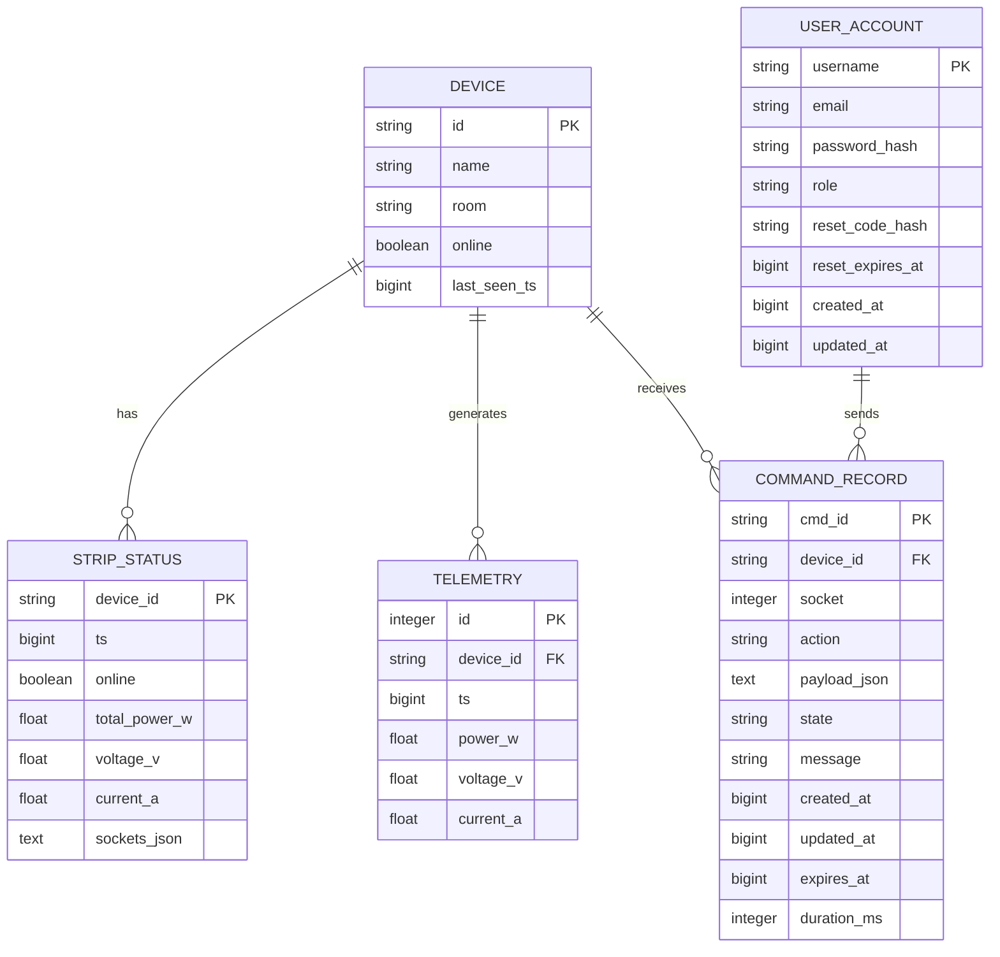

# 宿舍电源管理系统数据库设计文档

## 1. 数据库设计概述

本数据库设计文档基于宿舍电源管理系统的需求分析，旨在为系统提供高效、可靠的数据存储方案。数据库设计遵循规范化原则，确保数据的一致性、完整性和可扩展性。

### 1.1 设计目标

- 支持设备管理、状态监控、命令控制、遥测数据采集和AI分析等核心功能
- 提供高效的数据存储和查询能力
- 确保数据的一致性和完整性
- 支持系统的可扩展性和未来功能的扩展

### 1.2 数据库选择

- **开发环境**：SQLite
  - 优点：轻量级、无需独立服务器、适合开发和测试
  - 缺点：并发性能有限

- **生产环境**：PostgreSQL
  - 优点：强大的关系型数据库、支持复杂查询、高并发性能
  - 缺点：需要独立服务器部署

## 2. 数据模型设计

### 2.1 实体关系图 (ERD)

### 2.2 数据模型说明

#### 2.2.1 Device（设备）

- **描述**：存储设备的基本信息
- **关键字段**：
  - `id`：设备唯一标识符
  - `name`：设备名称
  - `room`：设备所在房间
  - `online`：设备在线状态
  - `last_seen_ts`：设备最后一次通信时间戳

#### 2.2.2 StripStatus（设备状态）

- **描述**：存储设备的实时状态信息
- **关键字段**：
  - `device_id`：设备ID，外键关联Device表
  - `ts`：状态更新时间戳
  - `online`：设备在线状态
  - `total_power_w`：总功率（瓦）
  - `voltage_v`：电压（伏）
  - `current_a`：电流（安）
  - `sockets_json`：各插孔状态的JSON字符串

#### 2.2.3 Telemetry（遥测数据）

- **描述**：存储设备的用电遥测数据
- **关键字段**：
  - `id`：遥测数据ID
  - `device_id`：设备ID，外键关联Device表
  - `ts`：数据采集时间戳
  - `power_w`：功率（瓦）
  - `voltage_v`：电压（伏）
  - `current_a`：电流（安）

#### 2.2.4 CommandRecord（命令记录）

- **描述**：存储设备控制命令的执行记录
- **关键字段**：
  - `cmd_id`：命令唯一标识符
  - `device_id`：设备ID，外键关联Device表
  - `socket`：目标插孔号
  - `action`：命令动作类型
  - `payload_json`：命令参数的JSON字符串
  - `state`：命令执行状态
  - `message`：命令执行消息
  - `created_at`：命令创建时间戳
  - `updated_at`：命令更新时间戳
  - `expires_at`：命令过期时间戳
  - `duration_ms`：命令执行耗时（毫秒）

#### 2.2.5 UserAccount（用户账号）

- **描述**：存储系统用户账号信息
- **关键字段**：
  - `username`：用户名
  - `email`：邮箱
  - `password_hash`：密码哈希
  - `role`：用户角色
  - `reset_code_hash`：密码重置码哈希
  - `reset_expires_at`：密码重置码过期时间戳
  - `created_at`：账号创建时间戳
  - `updated_at`：账号更新时间戳

## 3. 表结构设计

### 3.1 devices表

| 字段名 | 数据类型 | 约束 | 描述 |
|--------|----------|------|------|
| id | VARCHAR(64) | PRIMARY KEY | 设备唯一标识符 |
| name | VARCHAR(128) | NOT NULL | 设备名称 |
| room | VARCHAR(64) | NOT NULL | 设备所在房间 |
| online | BOOLEAN | NOT NULL DEFAULT FALSE | 设备在线状态 |
| last_seen_ts | BIGINT | NOT NULL DEFAULT 0 | 设备最后一次通信时间戳 |

### 3.2 strip_status表

| 字段名 | 数据类型 | 约束 | 描述 |
|--------|----------|------|------|
| device_id | VARCHAR(64) | PRIMARY KEY | 设备ID，关联devices表 |
| ts | BIGINT | NOT NULL | 状态更新时间戳 |
| online | BOOLEAN | NOT NULL DEFAULT FALSE | 设备在线状态 |
| total_power_w | FLOAT | NOT NULL DEFAULT 0.0 | 总功率（瓦） |
| voltage_v | FLOAT | NOT NULL DEFAULT 220.0 | 电压（伏） |
| current_a | FLOAT | NOT NULL DEFAULT 0.0 | 电流（安） |
| sockets_json | TEXT | NOT NULL DEFAULT '[]' | 各插孔状态的JSON字符串 |

### 3.3 telemetry表

| 字段名 | 数据类型 | 约束 | 描述 |
|--------|----------|------|------|
| id | INTEGER | PRIMARY KEY AUTOINCREMENT | 遥测数据ID |
| device_id | VARCHAR(64) | NOT NULL INDEX | 设备ID，关联devices表 |
| ts | BIGINT | NOT NULL INDEX | 数据采集时间戳 |
| power_w | FLOAT | NOT NULL DEFAULT 0.0 | 功率（瓦） |
| voltage_v | FLOAT | NOT NULL DEFAULT 220.0 | 电压（伏） |
| current_a | FLOAT | NOT NULL DEFAULT 0.0 | 电流（安） |

### 3.4 cmd_records表

| 字段名 | 数据类型 | 约束 | 描述 |
|--------|----------|------|------|
| cmd_id | VARCHAR(64) | PRIMARY KEY | 命令唯一标识符 |
| device_id | VARCHAR(64) | NOT NULL INDEX | 设备ID，关联devices表 |
| socket | INTEGER | NULL | 目标插孔号 |
| action | VARCHAR(64) | NOT NULL | 命令动作类型 |
| payload_json | TEXT | NOT NULL DEFAULT '{}' | 命令参数的JSON字符串 |
| state | VARCHAR(16) | NOT NULL DEFAULT 'pending' | 命令执行状态 |
| message | VARCHAR(255) | NOT NULL DEFAULT '' | 命令执行消息 |
| created_at | BIGINT | NOT NULL | 命令创建时间戳 |
| updated_at | BIGINT | NOT NULL | 命令更新时间戳 |
| expires_at | BIGINT | NOT NULL | 命令过期时间戳 |
| duration_ms | INTEGER | NULL | 命令执行耗时（毫秒） |

### 3.5 user_accounts表

| 字段名 | 数据类型 | 约束 | 描述 |
|--------|----------|------|------|
| username | VARCHAR(64) | PRIMARY KEY | 用户名 |
| email | VARCHAR(128) | NOT NULL UNIQUE INDEX | 邮箱 |
| password_hash | VARCHAR(255) | NOT NULL | 密码哈希 |
| role | VARCHAR(16) | NOT NULL DEFAULT 'admin' | 用户角色 |
| reset_code_hash | VARCHAR(255) | NOT NULL DEFAULT '' | 密码重置码哈希 |
| reset_expires_at | BIGINT | NOT NULL DEFAULT 0 | 密码重置码过期时间戳 |
| created_at | BIGINT | NOT NULL | 账号创建时间戳 |
| updated_at | BIGINT | NOT NULL | 账号更新时间戳 |

## 4. 索引设计

### 4.1 设备相关索引

| 表名 | 索引名 | 字段 | 类型 | 描述 |
|------|--------|------|------|------|
| devices | idx_devices_room | room | 普通索引 | 加速按房间查询设备 |
| devices | idx_devices_online | online | 普通索引 | 加速查询在线/离线设备 |

### 4.2 遥测数据索引

| 表名 | 索引名 | 字段 | 类型 | 描述 |
|------|--------|------|------|------|
| telemetry | idx_telemetry_device_ts | device_id, ts | 复合索引 | 加速按设备和时间范围查询遥测数据 |

### 4.3 命令记录索引

| 表名 | 索引名 | 字段 | 类型 | 描述 |
|------|--------|------|------|------|
| cmd_records | idx_cmd_records_device_state | device_id, state | 复合索引 | 加速查询设备的命令执行状态 |
| cmd_records | idx_cmd_records_expires | expires_at | 普通索引 | 加速查询过期命令 |

### 4.4 用户账号索引

| 表名 | 索引名 | 字段 | 类型 | 描述 |
|------|--------|------|------|------|
| user_accounts | idx_user_accounts_email | email | 唯一索引 | 加速按邮箱查询用户 |

## 5. 数据完整性约束

### 5.1 主键约束

- 所有表都有主键，确保数据的唯一性
- `devices`表：`id`为主键
- `strip_status`表：`device_id`为主键
- `telemetry`表：`id`为主键
- `cmd_records`表：`cmd_id`为主键
- `user_accounts`表：`username`为主键

### 5.2 外键约束

- `strip_status.device_id` 引用 `devices.id`
- `telemetry.device_id` 引用 `devices.id`
- `cmd_records.device_id` 引用 `devices.id`

### 5.3 非空约束

- 关键字段设置为非空，确保数据的完整性
- 例如：`devices.name`、`devices.room`、`telemetry.device_id`等

### 5.4 默认值约束

- 为某些字段设置默认值，确保数据的一致性
- 例如：`devices.online`默认为`false`，`strip_status.total_power_w`默认为`0.0`

## 6. 数据迁移与初始化

### 6.1 数据库初始化

- 系统启动时自动创建数据库表结构
- 自动生成默认管理员账号
- 自动创建种子设备数据，便于前端联调

### 6.2 数据迁移策略

- 对于结构变更，使用SQLAlchemy的迁移工具（如Alembic）进行管理
- 对于数据变更，编写迁移脚本确保数据的一致性

## 7. 性能优化

### 7.1 查询优化

- 为常用查询添加适当的索引
- 使用分页查询减少数据传输量
- 对于遥测数据，根据时间范围进行合理的采样和聚合

### 7.2 存储优化

- 对于遥测数据，考虑使用分区表或定期归档策略
- 优化数据库配置，如缓存大小、连接池等

### 7.3 写入优化

- 使用批量写入减少数据库操作次数
- 对于高频数据采集，考虑使用消息队列进行缓冲

## 8. 安全考虑

### 8.1 数据安全

- 密码使用哈希存储，不存储明文密码
- 敏感数据传输使用HTTPS加密
- 定期备份数据库，防止数据丢失

### 8.2 访问控制

- 实现基于角色的访问控制
- 对API接口进行认证和授权
- 限制数据库用户权限，遵循最小权限原则

## 9. 总结

本数据库设计文档详细描述了宿舍电源管理系统的数据库设计，包括数据模型、表结构、索引设计、数据完整性约束、数据迁移与初始化、性能优化和安全考虑。该设计支持系统的核心功能，确保数据的一致性、完整性和可靠性，同时考虑了系统的可扩展性和未来功能的扩展。

数据库设计遵循了规范化原则，使用了适当的索引和约束，确保了系统的性能和可靠性。同时，考虑了数据安全和访问控制，保护系统数据的安全。

该设计可以根据实际需求进行调整和优化，以满足系统的具体要求。