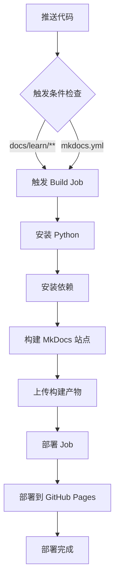

# GitHub Pages CI/CD 部署指南 🚀

本指南将帮助你通过 GitHub Actions 自动部署教学文档到 GitHub Pages。

## 📋 前置要求

- ✅ GitHub 账号
- ✅ 项目已推送到 GitHub
- ✅ 已安装 Git

## 🔧 配置步骤

### 步骤 1：更新 mkdocs.yml 配置

打开 `docs/learn/mkdocs.yml` 文件，修改以下配置项：

```yaml
# 将 your-github-username 替换为你的 GitHub 用户名
site_url: https://your-github-username.github.io/dorm-power-console

# 将 your-github-username 和 your-repo-name 替换为实际值
repo_name: dorm-power-console
repo_url: https://github.com/your-github-username/dorm-power-console
edit_uri: blob/main/docs/learn/
```

**示例**（假设你的 GitHub 用户名是 `zhangsan`）：

```yaml
site_url: https://zhangsan.github.io/dorm-power-console
repo_name: dorm-power-console
repo_url: https://github.com/zhangsan/dorm-power-console
edit_uri: blob/main/docs/learn/
```

### 步骤 2：配置 GitHub Pages 权限

1. 访问你的 GitHub 仓库
2. 进入 **Settings** → **Pages**
3. 在 **Build and deployment** 部分：
   - **Source**: 选择 **GitHub Actions**
   - 其他保持默认

### 步骤 3：推送代码到 GitHub

```bash
# 1. 初始化 Git（如果还未初始化）
git init

# 2. 添加所有文件
git add .

# 3. 提交更改
git commit -m "docs: 添加教学文档和 CI/CD 配置"

# 4. 添加远程仓库（替换为你的仓库地址）
git remote add origin https://github.com/your-github-username/dorm-power-console.git

# 5. 推送到 main 分支
git push -u origin main
```

### 步骤 4：查看部署状态

推送后，GitHub Actions 会自动触发：

1. 访问仓库的 **Actions** 标签页
2. 查看名为 `Deploy Documentation to GitHub Pages` 的工作流
3. 等待部署完成（通常 2-3 分钟）

### 步骤 5：访问部署的文档

部署成功后，访问：

```
https://your-github-username.github.io/dorm-power-console/
```

## 🔄 自动部署机制

### 触发条件

以下操作会自动触发部署：

1. **推送到 main 分支**
   - 修改 `docs/learn/` 目录下的文件
   - 修改 `mkdocs.yml` 配置文件

2. **手动触发**
   - Actions → Deploy Documentation → Run workflow

3. **Pull Request**
   - 会触发预览构建，但不会部署

### 部署流程



## 📝 工作流文件说明

`.github/workflows/docs-deploy.yml` 包含两个 Job：

### Build Job

```yaml
build:
  runs-on: ubuntu-latest
  steps:
    - 检出代码
    - 设置 Python 3.11
    - 安装依赖 (pip install -r requirements.txt)
    - 构建站点 (mkdocs build)
    - 上传构建产物
```

### Deploy Job

```yaml
deploy:
  needs: build
  runs-on: ubuntu-latest
  steps:
    - 部署到 GitHub Pages (deploy-pages@v4)
```

## ⚙️ 高级配置

### 1. 自定义域名

如果要使用自定义域名（如 `docs.example.com`）：

1. 在 `docs/learn/` 目录创建 `CNAME` 文件：
   ```
   docs.example.com
   ```

2. 配置 DNS：
   - 添加 CNAME 记录指向 `your-github-username.github.io`

3. 更新 `mkdocs.yml`：
   ```yaml
   site_url: https://docs.example.com
   ```

### 2. 环境变量

可以在工作流中添加环境变量：

```yaml
env:
  MKDOCS_CONFIG: mkdocs.yml
  SITE_DIR: ../../site
```

### 3. 通知配置

添加部署成功/失败的通知：

```yaml
- name: Notify on success
  if: success()
  uses: actions/github-script@v6
  with:
    script: |
      console.log('部署成功！')

- name: Notify on failure
  if: failure()
  uses: actions/github-script@v6
  with:
    script: |
      console.error('部署失败！')
```

## 🐛 故障排除

### 问题 1: 部署失败 - Permission denied

**错误信息**:
```
Error: Permission denied for ref: refs/heads/gh-pages
```

**解决方案**:
1. 检查仓库权限：Settings → Actions → General
2. 确保 **Workflow permissions** 设置为 **Read and write permissions**

### 问题 2: 构建失败 - Module not found

**错误信息**:
```
ModuleNotFoundError: No module named 'mkdocs'
```

**解决方案**:
1. 检查 `requirements.txt` 是否包含所有依赖
2. 确保依赖版本兼容

### 问题 3: 404 错误

**现象**: 访问部署的 URL 显示 404

**解决方案**:
1. 等待几分钟（GitHub Pages 需要时间生效）
2. 检查 `site_url` 配置是否正确
3. 查看 Actions 日志确认部署成功

### 问题 4: 样式丢失

**现象**: 页面显示正常但样式丢失

**解决方案**:
1. 检查 `extra_css` 路径是否正确
2. 清除浏览器缓存
3. 检查 `site_dir` 配置

## 📊 查看部署日志

### 方法 1: GitHub Web 界面

1. 访问仓库 → **Actions** 标签
2. 选择工作流运行
3. 查看详细日志

### 方法 2: GitHub CLI

```bash
# 查看最近的运行
gh run list

# 查看特定运行的日志
gh run view <run-id> --log
```

## 🎯 最佳实践

### 1. 版本控制

- 使用语义化版本标签
- 在重要版本发布时手动触发部署

```bash
git tag v1.0.0
git push origin v1.0.0
```

### 2. 预览部署

对于 Pull Request，可以添加预览部署：

```yaml
- name: Deploy preview
  if: github.event_name == 'pull_request'
  uses: peaceiris/actions-gh-pages@v3
  with:
    github_token: ${{ secrets.GITHUB_TOKEN }}
    publish_dir: ./site
    destination_dir: preview/pr-${{ github.event.number }}
```

### 3. 缓存优化

已配置 pip 缓存，加速依赖安装：

```yaml
- name: Setup Python
  uses: actions/setup-python@v5
  with:
    python-version: '3.11'
    cache: 'pip'
```

### 4. 并发控制

已配置并发控制，避免同时部署：

```yaml
concurrency:
  group: "pages"
  cancel-in-progress: false
```

## 📈 监控和统计

### 1. 访问统计

集成 Google Analytics：

```yaml
extra:
  analytics:
    provider: google
    property: G-XXXXXXXXXX
```

### 2. 部署时间

查看平均部署时间：
- Actions → 查看历史运行记录
- 优化慢的步骤

## 🔐 安全建议

1. **不要提交敏感信息**
   - API 密钥
   - 数据库密码
   - 个人敏感信息

2. **使用 GitHub Secrets**
   ```yaml
   env:
     API_KEY: ${{ secrets.API_KEY }}
   ```

3. **定期更新依赖**
   ```bash
   pip install --upgrade -r requirements.txt
   ```

## 📚 参考资源

- [GitHub Actions 文档](https://docs.github.com/en/actions)
- [GitHub Pages 文档](https://docs.github.com/en/pages)
- [MkDocs 文档](https://www.mkdocs.org/)
- [Material 主题文档](https://squidfunk.github.io/mkdocs-material/)

## 🎉 部署检查清单

部署前请确认：

- [ ] 已更新 `mkdocs.yml` 中的 `site_url` 和 `repo_url`
- [ ] 已配置 GitHub Pages 使用 GitHub Actions
- [ ] 已推送代码到 GitHub
- [ ] Actions 工作流正常运行
- [ ] 能够访问部署的文档

---

**最后更新**: 2024-04-21  
**维护者**: 教学文档编写组
