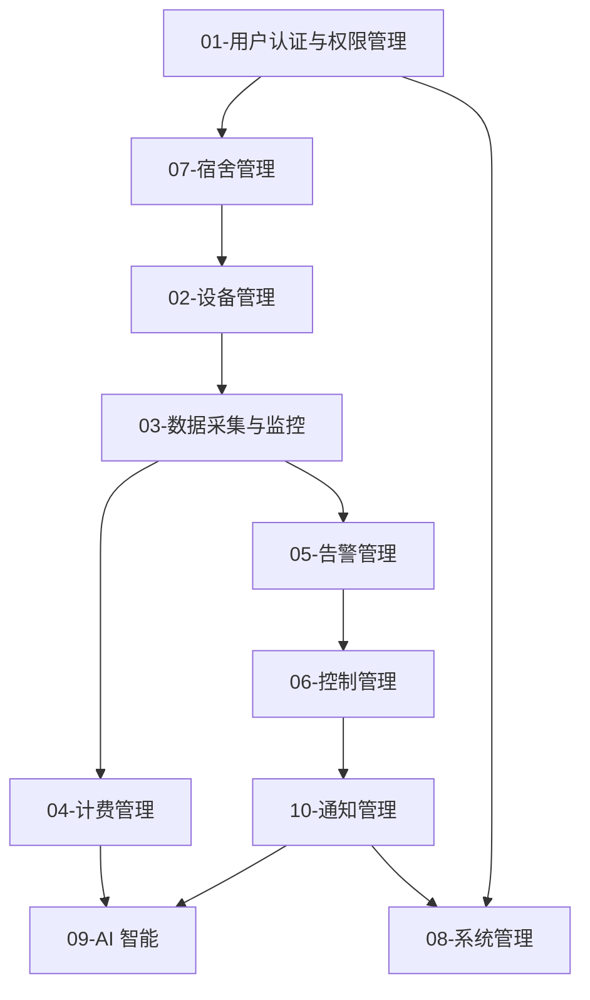

# 宿舍用电管理系统 - 项目系列学习文档

> 🎓 采用任务驱动式教学法，从零开始掌握企业级 Spring Boot + Vue 全栈开发

---

## 📚 文档概述

本系列文档是宿舍用电管理系统（DormPower）的模块化学习教程，包含 10 个核心模块的完整开发教程。每个模块按照统一的开发流程组织，涵盖从后端设计到前端实现的完整开发过程。

### 教学特色

- ✅ **目标导向** - 每个模块明确列出知识目标、能力目标、成果目标
- ✅ **分步实操** - 后端前端都按步骤分解，每步都有实操任务
- ✅ **完整代码** - 提供完整可运行的代码示例
- ✅ **文件结构** - 清晰展示完成后的文件结构
- ✅ **联调验证** - 提供详细的功能验证清单
- ✅ **扩展练习** - 分层级的练习题目（基础/进阶/挑战）

---

## 🚀 快速开始

### 学习前准备

**必需知识**:
- ✅ Java 编程基础（类、接口、继承、泛型）
- ✅ 数据库基础（SQL、表设计）
- ✅ HTML/CSS/JavaScript基础

**必需软件**:
- JDK 17+
- Node.js 18+
- Maven 3.8+
- Git

### 15 分钟快速体验

#### 步骤 1：启动后端（5 分钟）

```bash
cd backend
mvn spring-boot:run -Dspring-boot.run.profiles=dev
# 访问 http://localhost:8080/api/health
```

#### 步骤 2：启动前端（5 分钟）

```bash
cd frontend
npm install
npm run dev
# 访问 http://localhost:3000
```

#### 步骤 3：体验登录（5 分钟）

- 用户名：`admin`
- 密码：`admin123`

### 系统学习路径

1. **阅读教学规划** - 了解整体学习路径和评估标准
2. **从模块 01 开始** - 用户认证与权限管理（教学示范模块）
3. **使用检查清单** - 每完成一步就勾选确认

---

## 📖 学习路径规划

### 阶段一：基础入门（2 周）
- ✅ 开发环境搭建
- ✅ 项目结构认知
- ✅ 技术栈学习

**学习模块：**
1. [用户认证与权限管理](#模块-01 用户认证与权限管理) - 理解系统安全基础 ⭐ **教学示范模块**

### 阶段二：核心业务开发（4 周）
- ✅ 后端实体设计
- ✅ API 接口开发
- ✅ 前端页面实现

**学习模块：**
2. [宿舍管理](#模块 -07 宿舍管理) - 基础数据管理
3. [设备管理](#模块 -02 设备管理) - IoT 设备管理
4. [数据采集与监控](#模块 -03 数据采集与监控) - 实时数据处理
5. [计费管理](#模块 -04 计费管理) - 电费计费业务

### 阶段三：高级功能开发（3 周）
- ✅ 复杂业务逻辑处理
- ✅ 实时通信实现
- ✅ 智能化功能

**学习模块：**
6. [告警管理](#模块 -05 告警管理) - 智能告警处理
7. [控制管理](#模块 -06 控制管理) - 设备远程控制
8. [通知管理](#模块 -10 通知管理) - 消息推送服务

### 阶段四：系统优化与 AI（2 周）
- ✅ 系统管理功能
- ✅ AI 功能集成
- ✅ 性能优化

**学习模块：**
9. [系统管理](#模块 -08 系统管理) - 系统配置与监控
10. [AI 智能](#模块 -09AI 智能) - 人工智能应用

---

## 📁 模块教程导航

| 模块 | 难度 | 时长 | 核心内容 | 状态 |
|------|------|------|---------|------|
| [01-用户认证](#模块 -01 用户认证与权限管理) | ⭐⭐⭐ | 3-5 天 | Spring Security, JWT, RBAC | ✅ 已完成 |
| [07-宿舍管理](#模块 -07 宿舍管理) | ⭐⭐ | 2-3 天 | 基础数据，入住退宿 | ⬜ 待更新 |
| [02-设备管理](#模块 -02 设备管理) | ⭐⭐⭐⭐ | 4-5 天 | IoT, MQTT, 设备生命周期 | ⬜ 待更新 |
| [03-数据采集](#模块 -03 数据采集与监控) | ⭐⭐⭐⭐ | 4-5 天 | 实时数据，时序数据，监控 | ⬜ 待更新 |
| [04-计费管理](#模块 -04 计费管理) | ⭐⭐⭐ | 3-4 天 | 电费计算，账单，支付 | ⬜ 待更新 |
| [05-告警管理](#模块 -05 告警管理) | ⭐⭐⭐ | 3-4 天 | 告警规则，通知，闭环管理 | ⬜ 待更新 |
| [06-控制管理](#模块 -06 控制管理) | ⭐⭐⭐⭐ | 4-5 天 | 远程控制，MQTT 命令 | ⬜ 待更新 |
| [08-系统管理](#模块 -08 系统管理) | ⭐⭐⭐ | 3-4 天 | 配置，日志，审计 | ⬜ 待更新 |
| [09-AI 智能](#模块 -09AI 智能) | ⭐⭐⭐⭐⭐ | 4-5 天 | AI 报告，智能问答 | ⬜ 待更新 |
| [10-通知管理](#模块 -10 通知管理) | ⭐⭐⭐ | 3-4 天 | 多渠道通知，模板 | ⬜ 待更新 |

---

## 📋 每个模块的学习步骤

### 标准学习流程

```
1. 阅读实现目标 → 明确学习什么
2. 阅读需求分析 → 理解业务场景
3. 后端实现（4 步） → 实体→Repository→Service→Controller
4. 单元测试 → 编写并运行测试
5. 前端实现（5 步） → 类型→API→页面→状态→路由
6. 联调验证 → 后端验证 + 前端验证 + 联调
7. 查看文件结构 → 对照检查
8. 完成扩展练习 → 基础→进阶→挑战
9. 总结知识点 → 巩固提升
```

### 评估标准

**基础要求（必须完成）：**
- ✅ 后端实体类设计合理
- ✅ API 接口可正常调用
- ✅ 前端页面可正常访问
- ✅ 单元测试通过
- ✅ 前后端联调成功

**进阶要求（选做）：**
- ⭐ 代码质量高，符合规范
- ⭐ 异常处理完善
- ⭐ 性能优化到位
- ⭐ 扩展功能实现

---

## 🎯 模块学习顺序与依赖关系



---

## 📝 模块详细内容

### 模块 01：用户认证与权限管理

**学习时长**: 3-5 天  
**难度**: ⭐⭐⭐☆☆  
**前置知识**: Java 基础、Spring Boot 入门、Vue 基础

#### 一、实现目标 ⭐

**知识目标**:
- ✅ 理解 Spring Security 工作原理
- ✅ 掌握 JWT 认证机制
- ✅ 理解 RBAC 权限模型设计
- ✅ 掌握前后端分离认证流程

**能力目标**:
- ✅ 能够独立设计用户认证系统
- ✅ 能够实现 JWT Token 生成与验证
- ✅ 能够实现基于角色的权限控制
- ✅ 能够完成前后端认证联调

**成果目标**:
- 📁 完整的用户认证后端 API（登录、登出、刷新 Token）
- 📁 用户管理、角色管理、权限管理功能
- 📁 前端登录页面和用户管理页面
- 📁 完善的单元测试用例
- 📁 可运行的认证授权系统

#### 二、需求分析与设计

**业务场景**:
1. 用户登录：用户名密码认证，返回 JWT Token
2. 权限控制：基于角色的访问控制
3. 角色管理：管理员创建角色并分配权限

**功能需求清单**:
| 功能 | 描述 | 优先级 |
|------|------|--------|
| 用户登录 | 用户名密码认证，返回 JWT Token | P0 |
| 用户登出 | 使 Token 失效 | P0 |
| Token 刷新 | Token 过期前刷新 | P0 |
| 用户管理 | 用户 CRUD、重置密码 | P0 |
| 角色管理 | 角色 CRUD、分配权限 | P1 |

**技术选型**:
| 技术 | 说明 | 版本 |
|------|------|------|
| Spring Security | 安全框架 | 3.2.x |
| JWT | Token 认证 | 0.12.x |
| BCrypt | 密码加密 | - |
| Vue Router | 路由守卫 | 4.x |

#### 三、后端实现（分步骤）

**步骤 1：实体类设计**
- UserAccount（用户账户）
- Role（角色）
- Permission（权限）
- LoginLog（登录日志）

**步骤 2：Repository 层**
- UserAccountRepository
- RoleRepository
- PermissionRepository

**步骤 3：Service 层**
- AuthService（认证服务）
- UserService（用户服务）
- RbacService（权限服务）

**步骤 4：Controller 层**
- AuthController（认证接口）
- UserController（用户管理接口）
- RbacController（权限管理接口）

#### 四、单元测试

- AuthControllerTest
- UserServiceTest
- 测试覆盖率要求：>80%

#### 五、前端实现（分步骤）

**步骤 1：类型定义**
- types/auth.ts

**步骤 2：API 封装**
- api/auth.ts

**步骤 3：页面组件**
- views/LoginView.vue
- views/UserManagementView.vue

**步骤 4：状态管理**
- stores/auth.ts

**步骤 5：路由配置**
- router/index.ts（路由守卫）

#### 六、联调验证

**后端验证**:
- [ ] 启动后端服务
- [ ] Postman 测试登录接口
- [ ] 验证 Token 格式
- [ ] 测试受保护接口
- [ ] 测试 Token 刷新

**前端验证**:
- [ ] 启动前端服务
- [ ] 访问登录页面
- [ ] 测试登录功能
- [ ] 验证 Token 存储
- [ ] 测试刷新页面
- [ ] 测试登出功能

#### 七、完成后的文件结构 📁

**后端**:
```
backend/src/main/java/com/dormpower/
├── model/
│   ├── UserAccount.java
│   ├── Role.java
│   ├── Permission.java
│   └── LoginLog.java
├── repository/
│   ├── UserAccountRepository.java
│   └── RoleRepository.java
├── service/
│   ├── AuthService.java
│   └── impl/AuthServiceImpl.java
├── controller/
│   ├── AuthController.java
│   └── UserController.java
└── config/
    └── SecurityConfig.java
```

**前端**:
```
frontend/src/
├── types/
│   └── auth.ts
├── api/
│   └── auth.ts
├── views/
│   ├── LoginView.vue
│   └── UserManagementView.vue
├── stores/
│   └── auth.ts
└── router/
    └── index.ts
```

#### 八、扩展练习 💪

**基础练习**:
1. 添加邮箱验证功能
2. 实现密码找回功能
3. 添加登录验证码

**进阶练习**:
1. 实现双因素认证（2FA）
2. 集成第三方登录（微信、QQ）
3. 实现登录设备管理

**挑战练习**:
1. 实现 OAuth2 认证服务器
2. 实现单点登录（SSO）
3. 实现权限动态配置

#### 九、知识点总结 📝

**后端知识点**:
1. Spring Security 工作原理
2. JWT 认证机制
3. BCrypt 密码加密
4. RBAC 权限模型

**前端知识点**:
1. Vue Router 守卫
2. Pinia 状态管理
3. Axios 拦截器
4. TypeScript 类型定义

**最佳实践**:
1. 密码加密存储
2. HTTPS 传输
3. Token 安全存储
4. CSRF 防护

---

### 模块 02：设备管理模块

> 📝 **状态**: 待更新  
> 按照模块 01 的模板格式编写

**学习时长**: 4-5 天  
**难度**: ⭐⭐⭐⭐  
**前置知识**: 模块 01 完成

#### 一、实现目标 ⭐

**知识目标**:
- 理解 IoT 设备管理架构
- 掌握 MQTT 通信协议
- 理解设备生命周期管理

**能力目标**:
- 能够设计设备管理数据库
- 能够实现 MQTT 设备通信
- 能够完成设备状态监控

**成果目标**:
- 📁 设备 CRUD 接口
- 📁 设备分组管理功能
- 📁 设备状态实时监控
- 📁 固件升级功能

#### 二、需求分析与设计

**业务场景**:
1. 设备注册与信息管理
2. 设备状态实时监控
3. 设备分组管理
4. 固件升级（OTA）

**功能需求清单**:
| 功能 | 描述 | 优先级 |
|------|------|--------|
| 设备 CRUD | 设备创建、查询、更新、删除 | P0 |
| 设备状态监控 | 实时获取设备状态 | P0 |
| 设备分组 | 设备分组管理 | P1 |
| 固件升级 | OTA 远程升级 | P2 |

#### 三、后端实现（分步骤）

**步骤 1：实体类设计**
- Device（设备）
- DeviceGroup（设备组）
- DeviceStatusHistory（设备状态历史）
- DeviceFirmware（设备固件）

**步骤 2：Repository 层**
- DeviceRepository
- DeviceGroupRepository

**步骤 3：Service 层**
- DeviceService
- DeviceGroupService
- MqttBridge（MQTT 桥接）

**步骤 4：Controller 层**
- DeviceController
- DeviceGroupController
- DeviceFirmwareController

#### 四、单元测试

- DeviceControllerTest
- DeviceServiceTest
- MqttBridgeTest

#### 五、前端实现（分步骤）

**步骤 1：类型定义**
- types/device.ts

**步骤 2：API 封装**
- api/device.ts

**步骤 3：页面组件**
- views/DevicesView.vue
- views/DeviceDetailView.vue
- views/DeviceGroupView.vue

**步骤 4：状态管理**
- stores/device.ts

**步骤 5：路由配置**
- router/index.ts

#### 六、联调验证

**后端验证**:
- [ ] 设备 CRUD 接口测试
- [ ] MQTT 消息接收测试
- [ ] 设备状态更新测试

**前端验证**:
- [ ] 设备列表页面
- [ ] 设备详情页面
- [ ] 实时状态刷新

#### 七、完成后的文件结构 📁

（略，按照实际文件填写）

#### 八、扩展练习 💪

**基础练习**:
1. 设备批量导入
2. 设备搜索功能

**进阶练习**:
1. 设备离线缓存
2. 设备状态统计

**挑战练习**:
1. 设备预测性维护
2. 设备健康度评估

#### 九、知识点总结 📝

**核心知识点**:
1. MQTT 协议
2. 设备状态机
3. 实时数据推送
4. OTA 升级流程

---

### 模块 03：数据采集与监控

> 📝 **状态**: 待更新  
> 按照模块 01 的模板格式编写

**学习时长**: 4-5 天  
**难度**: ⭐⭐⭐⭐  
**前置知识**: 模块 01、02 完成

#### 一、实现目标 ⭐

**知识目标**:
- 理解时序数据特点
- 掌握高频数据采集方案
- 理解实时监控系统设计

**能力目标**:
- 能够设计时序数据存储方案
- 能够实现数据采集服务
- 能够完成实时监控功能

**成果目标**:
- 📁 遥测数据采集接口
- 📁 历史数据查询功能
- 📁 实时监控图表
- 📁 数据统计分析

#### 二、需求分析与设计

**业务场景**:
1. 设备定时上报用电数据
2. 实时数据监控与展示
3. 历史数据查询与分析
4. 数据采集任务管理

**功能需求清单**:
| 功能 | 描述 | 优先级 |
|------|------|--------|
| 遥测数据采集 | 接收设备上报数据 | P0 |
| 实时数据查询 | 获取最新数据 | P0 |
| 历史数据查询 | 时间范围查询 | P0 |
| 数据统计 | 聚合统计 | P1 |

#### 三、后端实现（分步骤）

**步骤 1：实体类设计**
- Telemetry（遥测数据）
- CollectionRecord（采集记录）
- SystemMetrics（系统指标）

**步骤 2：Repository 层**
- TelemetryRepository
- CollectionRecordRepository

**步骤 3：Service 层**
- TelemetryService
- CollectionService
- MonitoringService

**步骤 4：Controller 层**
- TelemetryController
- CollectionController
- MonitoringController

#### 四、单元测试

- TelemetryControllerTest
- TelemetryServiceTest

#### 五、前端实现（分步骤）

**步骤 1：类型定义**
- types/telemetry.ts

**步骤 2：API 封装**
- api/telemetry.ts

**步骤 3：页面组件**
- views/TelemetryView.vue
- views/LiveView.vue
- views/HistoryView.vue

**步骤 4：状态管理**
- stores/telemetry.ts

**步骤 5：路由配置**
- router/index.ts

#### 六、联调验证

**后端验证**:
- [ ] 遥测数据接收
- [ ] 历史数据查询
- [ ] 数据统计

**前端验证**:
- [ ] 实时数据展示
- [ ] 历史数据图表
- [ ] WebSocket 推送

#### 七、完成后的文件结构 📁

（略）

#### 八、扩展练习 💪

**基础练习**:
1. 数据导出功能
2. 数据筛选

**进阶练习**:
1. 数据降采样
2. 数据聚合

**挑战练习**:
1. 时序数据库集成
2. 实时流处理

#### 九、知识点总结 📝

**核心知识点**:
1. 时序数据存储
2. 数据聚合查询
3. WebSocket 实时推送
4. 图表可视化

---

### 模块 04：计费管理

> 📝 **状态**: 待更新  
> 按照模块 01 的模板格式编写

**学习时长**: 3-4 天  
**难度**: ⭐⭐⭐  
**前置知识**: 模块 01、03 完成

#### 一、实现目标 ⭐

**知识目标**:
- 理解电费计费业务
- 掌握多种电价策略
- 理解账单生成流程

**能力目标**:
- 能够设计计费引擎
- 能够实现电费计算
- 能够完成账单管理

**成果目标**:
- 📁 电费计算引擎
- 📁 账单管理接口
- 📁 充值缴费功能
- 📁 余额管理

#### 二、需求分析与设计

**业务场景**:
1. 按月生成电费账单
2. 支持峰谷电价、阶梯电价
3. 在线充值缴费
4. 余额不足告警

**功能需求清单**:
| 功能 | 描述 | 优先级 |
|------|------|--------|
| 账单生成 | 根据用电量生成账单 | P0 |
| 电费计算 | 支持多种电价策略 | P0 |
| 充值缴费 | 在线充值 | P0 |
| 余额管理 | 余额查询、预警 | P1 |

#### 三、后端实现（分步骤）

**步骤 1：实体类设计**
- ElectricityBill（电费账单）
- ElectricityPriceRule（电价规则）
- RoomBalance（房间余额）
- RechargeRecord（充值记录）

**步骤 2：Repository 层**
- ElectricityBillRepository
- PriceRuleRepository

**步骤 3：Service 层**
- BillingService（计费服务）
- PriceService（电价服务）
- RechargeService（充值服务）

**步骤 4：Controller 层**
- BillingController
- PriceRuleController
- RechargeController

#### 四、单元测试

- BillingControllerTest
- BillingServiceTest

#### 五、前端实现（分步骤）

**步骤 1：类型定义**
- types/billing.ts

**步骤 2：API 封装**
- api/billing.ts

**步骤 3：页面组件**
- views/BillingView.vue
- views/RechargeView.vue

**步骤 4：状态管理**
- stores/billing.ts

**步骤 5：路由配置**
- router/index.ts

#### 六、联调验证

**后端验证**:
- [ ] 账单生成接口
- [ ] 电费计算接口
- [ ] 充值接口

**前端验证**:
- [ ] 账单列表页面
- [ ] 充值页面
- [ ] 余额显示

#### 七、完成后的文件结构 📁

（略）

#### 八、扩展练习 💪

**基础练习**:
1. 账单导出
2. 充值记录查询

**进阶练习**:
1. 自动充值
2. 电费预测

**挑战练习**:
1. 第三方支付集成
2. 信用额度

#### 九、知识点总结 📝

**核心知识点**:
1. 电费计算引擎
2. 电价策略配置
3. 支付流程设计
4. 余额管理

---

### 模块 05：告警管理

> 📝 **状态**: 待更新  
> 按照模块 01 的模板格式编写

**学习时长**: 3-4 天  
**难度**: ⭐⭐⭐  
**前置知识**: 模块 01、02 完成

#### 一、实现目标 ⭐

**知识目标**:
- 理解告警管理流程
- 掌握告警规则引擎设计
- 理解告警通知机制

**能力目标**:
- 能够设计告警规则引擎
- 能够实现告警通知
- 能够完成告警闭环管理

**成果目标**:
- 📁 告警规则配置
- 📁 实时告警生成
- 📁 告警通知推送
- 📁 告警处理流程

#### 二、需求分析与设计

**业务场景**:
1. 设备异常自动告警
2. 告警通知多渠道推送
3. 告警处理与闭环
4. 告警统计分析

**功能需求清单**:
| 功能 | 描述 | 优先级 |
|------|------|--------|
| 告警规则配置 | 配置告警阈值 | P0 |
| 实时告警生成 | 自动触发告警 | P0 |
| 告警通知 | 多渠道推送 | P0 |
| 告警处理 | 确认、解决、忽略 | P1 |

#### 三、后端实现（分步骤）

**步骤 1：实体类设计**
- DeviceAlert（设备告警）
- DeviceAlertConfig（告警配置）
- Notification（通知）

**步骤 2：Repository 层**
- DeviceAlertRepository
- AlertConfigRepository

**步骤 3：Service 层**
- AlertService（告警服务）
- AlertRuleEngine（规则引擎）
- NotificationService（通知服务）

**步骤 4：Controller 层**
- AlertController
- AlertConfigController

#### 四、单元测试

- AlertControllerTest
- AlertServiceTest

#### 五、前端实现（分步骤）

**步骤 1：类型定义**
- types/alert.ts

**步骤 2：API 封装**
- api/alert.ts

**步骤 3：页面组件**
- views/AlertManagementView.vue
- views/AlertConfigView.vue

**步骤 4：状态管理**
- stores/alert.ts

**步骤 5：路由配置**
- router/index.ts

#### 六、联调验证

**后端验证**:
- [ ] 告警规则匹配
- [ ] 告警自动生成
- [ ] 告警通知发送

**前端验证**:
- [ ] 告警列表页面
- [ ] 告警配置页面
- [ ] 实时告警推送

#### 七、完成后的文件结构 📁

（略）

#### 八、扩展练习 💪

**基础练习**:
1. 告警筛选功能
2. 告警统计

**进阶练习**:
1. 告警升级机制
2. 告警聚合

**挑战练习**:
1. 智能告警（机器学习）
2. 告警根因分析

#### 九、知识点总结 📝

**核心知识点**:
1. 告警规则引擎
2. 告警状态机
3. 多渠道通知
4. 告警闭环管理

---

### 模块 06：控制管理

> 📝 **状态**: 待更新  
> 按照模块 01 的模板格式编写

**学习时长**: 4-5 天  
**难度**: ⭐⭐⭐⭐  
**前置知识**: 模块 01、02、05 完成

#### 一、实现目标 ⭐

**知识目标**:
- 理解设备控制流程
- 掌握 MQTT 命令通信
- 理解命令可靠性保证

**能力目标**:
- 能够设计命令下发机制
- 能够实现设备远程控制
- 能够完成命令状态跟踪

**成果目标**:
- 📁 设备控制接口
- 📁 命令记录管理
- 📁 命令状态跟踪
- 📁 批量控制功能

#### 二、需求分析与设计

**业务场景**:
1. 远程开关控制
2. 功率限制设置
3. 批量控制操作
4. 命令执行跟踪

**功能需求清单**:
| 功能 | 描述 | 优先级 |
|------|------|--------|
| 开关控制 | 远程开关设备 | P0 |
| 功率限制 | 设置功率上限 | P0 |
| 命令历史 | 记录命令执行 | P1 |
| 批量控制 | 批量操作 | P2 |

#### 三、后端实现（分步骤）

**步骤 1：实体类设计**
- CommandRecord（命令记录）
- SystemConfig（系统配置）

**步骤 2：Repository 层**
- CommandRecordRepository

**步骤 3：Service 层**
- CommandService（命令服务）
- PowerControlService（功率控制）

**步骤 4：Controller 层**
- PowerControlController
- CommandQueryController

#### 四、单元测试

- PowerControlControllerTest
- CommandServiceTest

#### 五、前端实现（分步骤）

**步骤 1：类型定义**
- types/control.ts

**步骤 2：API 封装**
- api/control.ts

**步骤 3：页面组件**
- views/PowerControlView.vue
- views/CommandHistoryView.vue

**步骤 4：状态管理**
- stores/control.ts

**步骤 5：路由配置**
- router/index.ts

#### 六、联调验证

**后端验证**:
- [ ] 开关控制接口
- [ ] 功率限制接口
- [ ] 命令状态跟踪

**前端验证**:
- [ ] 功率控制页面
- [ ] 命令历史页面
- [ ] 实时状态反馈

#### 七、完成后的文件结构 📁

（略）

#### 八、扩展练习 💪

**基础练习**:
1. 命令重试功能
2. 命令超时处理

**进阶练习**:
1. 定时任务控制
2. 场景联动

**挑战练习**:
1. 命令队列优化
2. 分布式命令处理

#### 九、知识点总结 📝

**核心知识点**:
1. MQTT 命令通信
2. 命令状态机
3. 命令可靠性保证
4. 批量控制处理

---

### 模块 07：宿舍管理

> 📝 **状态**: 待更新  
> 按照模块 01 的模板格式编写

**学习时长**: 2-3 天  
**难度**: ⭐⭐  
**前置知识**: 模块 01 完成

#### 一、实现目标 ⭐

**知识目标**:
- 理解宿舍管理业务
- 掌握基础数据管理设计
- 理解入住/退宿流程

**能力目标**:
- 能够设计宿舍管理数据库
- 能够实现入住/退宿功能
- 能够完成批量导入

**成果目标**:
- 📁 楼栋管理接口
- 📁 房间管理接口
- 📁 学生管理接口
- 📁 入住/退宿功能

#### 二、需求分析与设计

**业务场景**:
1. 宿舍楼栋管理
2. 房间分配与调整
3. 学生入住/退宿
4. 批量导入数据

**功能需求清单**:
| 功能 | 描述 | 优先级 |
|------|------|--------|
| 楼栋管理 | 楼栋 CRUD | P0 |
| 房间管理 | 房间 CRUD | P0 |
| 学生管理 | 学生 CRUD | P0 |
| 入住/退宿 | 办理入住退宿 | P0 |

#### 三、后端实现（分步骤）

**步骤 1：实体类设计**
- Building（宿舍楼）
- DormRoom（宿舍房间）
- Student（学生）
- StudentRoomHistory（住宿历史）

**步骤 2：Repository 层**
- BuildingRepository
- DormRoomRepository
- StudentRepository

**步骤 3：Service 层**
- BuildingService
- DormRoomService
- StudentService
- HousingService（住宿服务）

**步骤 4：Controller 层**
- BuildingController
- DormRoomController
- StudentController

#### 四、单元测试

- DormRoomControllerTest
- StudentControllerTest

#### 五、前端实现（分步骤）

**步骤 1：类型定义**
- types/dormitory.ts

**步骤 2：API 封装**
- api/dormitory.ts

**步骤 3：页面组件**
- views/DormManagementView.vue
- views/StudentManagementView.vue

**步骤 4：状态管理**
- stores/dormitory.ts

**步骤 5：路由配置**
- router/index.ts

#### 六、联调验证

**后端验证**:
- [ ] 房间 CRUD 接口
- [ ] 学生 CRUD 接口
- [ ] 入住/退宿接口

**前端验证**:
- [ ] 宿舍管理页面
- [ ] 学生管理页面
- [ ] 批量导入功能

#### 七、完成后的文件结构 📁

（略）

#### 八、扩展练习 💪

**基础练习**:
1. 房间搜索功能
2. 学生搜索功能

**进阶练习**:
1. 宿舍分配算法
2. 调宿申请流程

**挑战练习**:
1. 与学工系统对接
2. 与门禁系统对接

#### 九、知识点总结 📝

**核心知识点**:
1. 基础数据管理
2. 入住/退宿流程
3. 批量数据处理
4. 数据关联查询

---

### 模块 08：系统管理

> 📝 **状态**: 待更新  
> 按照模块 01 的模板格式编写

**学习时长**: 3-4 天  
**难度**: ⭐⭐⭐  
**前置知识**: 模块 01 完成

#### 一、实现目标 ⭐

**知识目标**:
- 理解系统管理功能
- 掌握审计日志实现
- 理解 AOP 切面编程

**能力目标**:
- 能够设计系统配置管理
- 能够实现审计日志
- 能够完成数据备份

**成果目标**:
- 📁 系统配置管理
- 📁 审计日志功能
- 📁 数据备份功能
- 📁 IP 访问控制

#### 二、需求分析与设计

**业务场景**:
1. 系统参数配置
2. 操作审计日志
3. 数据备份恢复
4. IP 访问控制

**功能需求清单**:
| 功能 | 描述 | 优先级 |
|------|------|--------|
| 系统配置 | 配置管理 | P0 |
| 审计日志 | 操作记录 | P0 |
| 数据备份 | 定时备份 | P1 |
| IP 控制 | 白名单/黑名单 | P2 |

#### 三、后端实现（分步骤）

**步骤 1：实体类设计**
- SystemConfig（系统配置）
- AuditLog（审计日志）
- SystemLog（系统日志）
- DataBackup（数据备份）

**步骤 2：Repository 层**
- SystemConfigRepository
- AuditLogRepository

**步骤 3：Service 层**
- SystemConfigService
- AuditLogService（AOP 切面）
- BackupService

**步骤 4：Controller 层**
- SystemConfigController
- AuditLogController
- DataBackupController

#### 四、单元测试

- SystemConfigControllerTest
- AuditLogAspectTest

#### 五、前端实现（分步骤）

**步骤 1：类型定义**
- types/system.ts

**步骤 2：API 封装**
- api/system.ts

**步骤 3：页面组件**
- views/SystemConfigView.vue
- views/AuditLogView.vue
- views/BackupManagementView.vue

**步骤 4：状态管理**
- stores/system.ts

**步骤 5：路由配置**
- router/index.ts

#### 六、联调验证

**后端验证**:
- [ ] 配置管理接口
- [ ] 审计日志记录
- [ ] 数据备份功能

**前端验证**:
- [ ] 系统配置页面
- [ ] 审计日志页面
- [ ] 备份管理页面

#### 七、完成后的文件结构 📁

（略）

#### 八、扩展练习 💪

**基础练习**:
1. 配置导入导出
2. 日志筛选功能

**进阶练习**:
1. 操作审计报表
2. 系统健康监控

**挑战练习**:
1. 审计日志防篡改
2. 备份加密

#### 九、知识点总结 📝

**核心知识点**:
1. 系统配置管理
2. AOP 切面编程
3. 审计日志记录
4. 数据备份恢复

---

### 模块 09：AI 智能

> 📝 **状态**: 待更新  
> 按照模块 01 的模板格式编写

**学习时长**: 4-5 天  
**难度**: ⭐⭐⭐⭐⭐  
**前置知识**: 模块 01、03、04 完成

#### 一、实现目标 ⭐

**知识目标**:
- 理解 AI 应用场景
- 掌握大模型 API 集成
- 理解提示词工程

**能力目标**:
- 能够集成 AI 大模型
- 能够实现智能问答
- 能够完成 AI 报告生成

**成果目标**:
- 📁 AI 用电分析报告
- 📁 智能问答助手
- 📁 用电行为分析
- 📁 负荷预测功能

#### 二、需求分析与设计

**业务场景**:
1. AI 生成用电分析报告
2. 智能问答助手
3. 用电行为分析
4. 负荷预测

**功能需求清单**:
| 功能 | 描述 | 优先级 |
|------|------|--------|
| AI 报告生成 | 自动生成用电分析 | P0 |
| 智能问答 | 用户问题解答 | P0 |
| 行为分析 | 用电行为分析 | P1 |
| 负荷预测 | 用电量预测 | P2 |

#### 三、后端实现（分步骤）

**步骤 1：实体类设计**
- AiReport（AI 报告）
- Agent（智能体配置）

**步骤 2：Repository 层**
- AiReportRepository

**步骤 3：Service 层**
- AiReportService
- AgentService
- AiAnalysisService（AI 分析服务）

**步骤 4：Controller 层**
- AiReportController
- AgentController

#### 四、单元测试

- AiReportControllerTest
- AiAnalysisServiceTest

#### 五、前端实现（分步骤）

**步骤 1：类型定义**
- types/ai.ts

**步骤 2：API 封装**
- api/ai.ts

**步骤 3：页面组件**
- views/AIReportView.vue
- views/AIChatView.vue
- views/AgentView.vue

**步骤 4：状态管理**
- stores/ai.ts

**步骤 5：路由配置**
- router/index.ts

#### 六、联调验证

**后端验证**:
- [ ] AI 报告生成接口
- [ ] 智能问答接口
- [ ] 行为分析接口

**前端验证**:
- [ ] AI 报告页面
- [ ] 智能问答页面
- [ ] 分析结果展示

#### 七、完成后的文件结构 📁

（略）

#### 八、扩展练习 💪

**基础练习**:
1. 报告模板定制
2. 问答历史记录

**进阶练习**:
1. 流式响应
2. 上下文理解

**挑战练习**:
1. 本地模型部署
2. 模型微调

#### 九、知识点总结 📝

**核心知识点**:
1. AI 大模型 API
2. 提示词工程
3. 流式响应处理
4. 上下文管理

---

### 模块 10：通知管理

> 📝 **状态**: 待更新  
> 按照模块 01 的模板格式编写

**学习时长**: 3-4 天  
**难度**: ⭐⭐⭐  
**前置知识**: 模块 01、05 完成

#### 一、实现目标 ⭐

**知识目标**:
- 理解通知管理需求
- 掌握多渠道通知发送
- 理解通知模板机制

**能力目标**:
- 能够设计通知系统
- 能够实现多渠道通知
- 能够完成通知偏好设置

**成果目标**:
- 📁 多渠道通知发送
- 📁 通知模板管理
- 📁 通知偏好设置
- 📁 通知中心

#### 二、需求分析与设计

**业务场景**:
1. 站内通知、邮件、短信推送
2. 通知模板配置
3. 用户通知偏好设置
4. 通知发送记录

**功能需求清单**:
| 功能 | 描述 | 优先级 |
|------|------|--------|
| 通知发送 | 多渠道发送 | P0 |
| 模板管理 | 通知模板配置 | P0 |
| 偏好设置 | 用户通知偏好 | P0 |
| 通知中心 | 站内通知 | P1 |

#### 三、后端实现（分步骤）

**步骤 1：实体类设计**
- Notification（通知）
- NotificationMessage（通知模板）
- NotificationPreference（通知偏好）

**步骤 2：Repository 层**
- NotificationRepository
- MessageTemplateRepository

**步骤 3：Service 层**
- NotificationService
- EmailService（邮件服务）
- SmsService（短信服务）

**步骤 4：Controller 层**
- NotificationController
- MessageTemplateController

#### 四、单元测试

- NotificationControllerTest
- NotificationServiceTest

#### 五、前端实现（分步骤）

**步骤 1：类型定义**
- types/notification.ts

**步骤 2：API 封装**
- api/notification.ts

**步骤 3：页面组件**
- views/NotificationView.vue
- views/NotificationSettingsView.vue
- views/MessageTemplateView.vue

**步骤 4：状态管理**
- stores/notification.ts

**步骤 5：路由配置**
- router/index.ts

#### 六、联调验证

**后端验证**:
- [ ] 通知发送接口
- [ ] 模板管理接口
- [ ] 偏好设置接口

**前端验证**:
- [ ] 通知中心页面
- [ ] 通知设置页面
- [ ] 模板管理页面

#### 七、完成后的文件结构 📁

（略）

#### 八、扩展练习 💪

**基础练习**:
1. 通知已读标记
2. 通知筛选功能

**进阶练习**:
1. 通知聚合
2. 智能推送时间

**挑战练习**:
1. 通知效果分析
2. A/B 测试

#### 九、知识点总结 📝

**核心知识点**:
1. 多渠道通知集成
2. 通知模板引擎
3. 通知偏好管理
4. 通知发送队列

---

## 📊 学习进度跟踪

### 模块完成情况

| 模块 | 开始日期 | 完成日期 | 掌握程度 | 状态 |
|------|---------|---------|---------|------|
| 01-用户认证 | | | ⬜1⬜2⬜3⬜4⬜5 | ✅ 已完成 |
| 02-设备管理 | | | ⬜1⬜2⬜3⬜4⬜5 | ⬜ 待更新 |
| 03-数据采集 | | | ⬜1⬜2⬜3⬜4⬜5 | ⬜ 待更新 |
| 04-计费管理 | | | ⬜1⬜2⬜3⬜4⬜5 | ⬜ 待更新 |
| 05-告警管理 | | | ⬜1⬜2⬜3⬜4⬜5 | ⬜ 待更新 |
| 06-控制管理 | | | ⬜1⬜2⬜3⬜4⬜5 | ⬜ 待更新 |
| 07-宿舍管理 | | | ⬜1⬜2⬜3⬜4⬜5 | ⬜ 待更新 |
| 08-系统管理 | | | ⬜1⬜2⬜3⬜4⬜5 | ⬜ 待更新 |
| 09-AI 智能 | | | ⬜1⬜2⬜3⬜4⬜5 | ⬜ 待更新 |
| 10-通知管理 | | | ⬜1⬜2⬜3⬜4⬜5 | ⬜ 待更新 |

**图例**:
- ⬜ 未开始
- 🔄 学习中
- ✅ 已完成
- ⭐ 优秀完成

---

## 📞 反馈与支持

### 学习资源

- **官方文档**:
  - [Spring Boot](https://spring.io/projects/spring-boot)
  - [Vue 3](https://vuejs.org/)
  - [TypeScript](https://www.typescriptlang.org/)

- **技术社区**:
  - [Stack Overflow](https://stackoverflow.com/)
  - [掘金](https://juejin.cn/)
  - [思否](https://segmentfault.com/)

### 联系方式

- 项目 Issues: [GitHub Issues](https://github.com/your-repo/issues)
- 讨论区：[GitHub Discussions](https://github.com/your-repo/discussions)

---

**最后更新**: 2026-04-21  
**文档版本**: 1.0  
**维护状态**: 持续更新中
