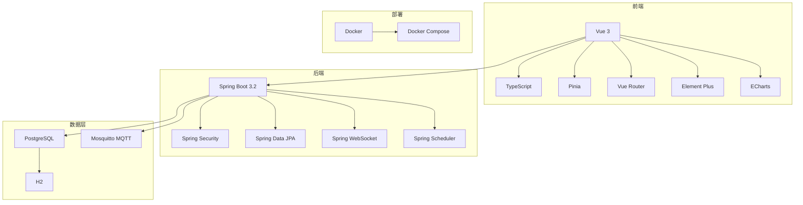
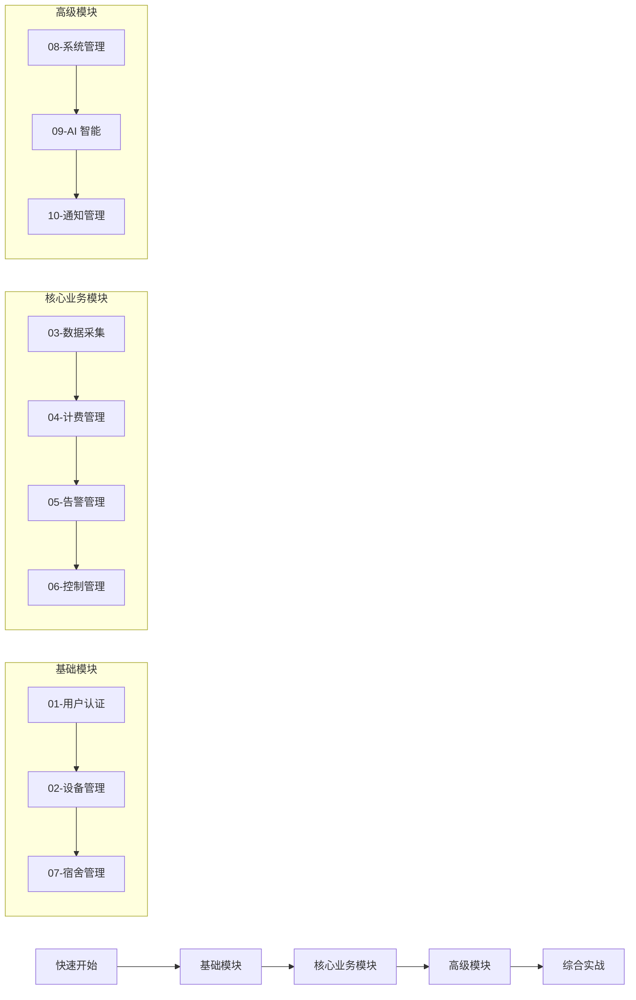
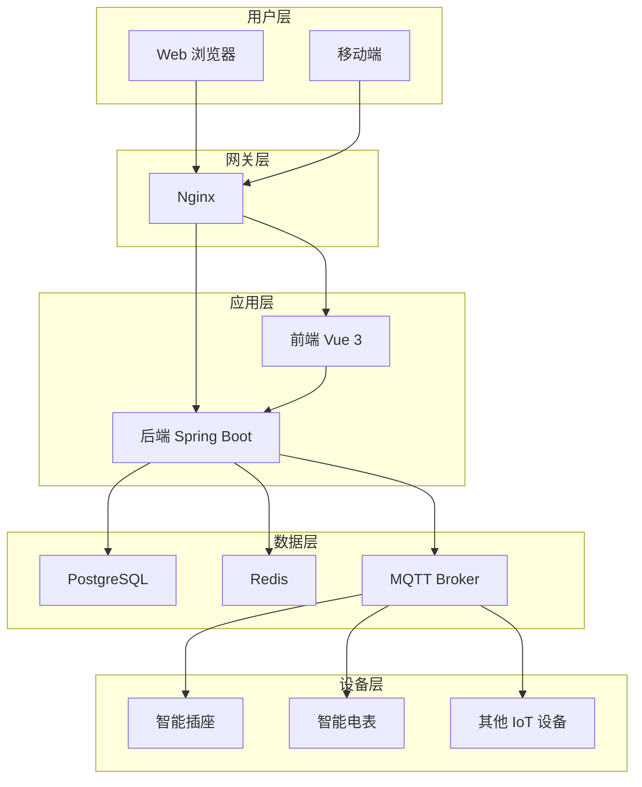

---
hide:
  - navigation
  - toc
---

# 宿舍用电管理系统 - 项目系列学习文档

> 🎓 采用任务驱动式教学法，从零开始掌握企业级 Spring Boot + Vue 全栈开发

---

## 📚 文档概述

本系列文档是宿舍用电管理系统（DormPower）的模块化学习教程，包含 **10 个核心模块**的完整开发教程。每个模块按照统一的开发流程组织，涵盖从后端设计到前端实现的完整开发过程。

### 🎯 教学特色

<div class="grid cards" markdown>

-   :material-book-open-page-variant: **目标导向**

    ---

    每个模块明确列出知识目标、能力目标、成果目标

-   :material-steps: **分步实操**

    ---

    后端前端都按步骤分解，每步都有实操任务

-   :material-code-tags: **完整代码**

    ---

    提供完整可运行的代码示例，代码高亮渲染

-   :material-folder-outline: **文件结构**

    ---

    清晰展示完成后的文件结构，便于对照检查

-   :material-check-all: **联调验证**

    ---

    提供详细的功能验证清单，确保功能正常

-   :material-dumbbell: **扩展练习**

    ---

    分层级的练习题目（基础/进阶/挑战）

</div>

### 📊 技术栈总览



---

## 🚀 快速开始

### 学习前准备

**必需知识**:
- ✅ Java 编程基础（类、接口、继承、泛型）
- ✅ 数据库基础（SQL、表设计）
- ✅ HTML/CSS/JavaScript基础

**必需软件**:
```bash
JDK 17+
Node.js 18+
Maven 3.8+
Git
```

### 15 分钟快速体验

#### 步骤 1：启动后端（5 分钟）

```bash
cd backend
mvn spring-boot:run -Dspring-boot.run.profiles=dev
```

✅ 验证：访问 http://localhost:8080/api/health

#### 步骤 2：启动前端（5 分钟）

```bash
cd frontend
npm install
npm run dev
```

✅ 验证：访问 http://localhost:3000

#### 步骤 3：登录系统（5 分钟）

默认账号：
- 用户名：`admin`
- 密码：`admin123`

---

## 📁 模块导航

### 基础模块

| 模块 | 难度 | 时长 | 核心内容 | 状态 |
|------|------|------|---------|------|
| [01-用户认证与权限管理](01-用户认证与权限管理模块.md) | ⭐⭐⭐ | 3-5 天 | Spring Security, JWT, RBAC | ✅ 已完成 |
| [02-设备管理](02-设备管理模块.md) | ⭐⭐⭐⭐ | 4-5 天 | IoT, MQTT, 设备生命周期 | ✅ 已完成 |
| [07-宿舍管理](07-宿舍管理模块.md) | ⭐⭐ | 2-3 天 | 基础数据，入住退宿 | ✅ 已完成 |

### 核心业务模块

| 模块 | 难度 | 时长 | 核心内容 | 状态 |
|------|------|------|---------|------|
| [03-数据采集与监控](03-数据采集与监控模块.md) | ⭐⭐⭐⭐ | 4-5 天 | 实时数据，时序数据，监控 | ✅ 已完成 |
| [04-计费管理](04-计费管理模块.md) | ⭐⭐⭐ | 3-4 天 | 电费计算，账单，支付 | ✅ 已完成 |
| [05-告警管理](05-告警管理模块.md) | ⭐⭐⭐ | 3-4 天 | 告警规则，通知，闭环管理 | ✅ 已完成 |
| [06-控制管理](06-控制管理模块.md) | ⭐⭐⭐⭐ | 4-5 天 | 远程控制，MQTT 命令 | ✅ 已完成 |

### 高级模块

| 模块 | 难度 | 时长 | 核心内容 | 状态 |
|------|------|------|---------|------|
| [08-系统管理](08-系统管理模块.md) | ⭐⭐⭐ | 3-4 天 | 配置，日志，审计 | ✅ 已完成 |
| [09-AI 智能](09-AI 智能模块.md) | ⭐⭐⭐⭐⭐ | 4-5 天 | AI 报告，智能问答 | ✅ 已完成 |
| [10-通知管理](10-通知管理模块.md) | ⭐⭐⭐ | 3-4 天 | 多渠道通知，模板 | ✅ 已完成 |

---

## 🎓 学习路径建议



---

## 📖 学习资源

### 官方文档

- [Spring Boot](https://spring.io/projects/spring-boot)
- [Vue 3](https://vuejs.org/)
- [TypeScript](https://www.typescriptlang.org/)
- [Element Plus](https://element-plus.org/)

### 技术社区

- [Stack Overflow](https://stackoverflow.com/)
- [掘金](https://juejin.cn/)
- [思否](https://segmentfault.com/)

---

## 📊 项目架构



---

## 🎯 学习目标

完成本系列学习后，你将能够：

### 后端能力
- ✅ 掌握 Spring Boot 3.2 企业级开发
- ✅ 理解 Spring Security 认证授权机制
- ✅ 掌握 Spring Data JPA 数据持久化
- ✅ 理解 MQTT 协议及 IoT 设备通信
- ✅ 掌握 WebSocket 实时通信
- ✅ 理解微服务架构设计

### 前端能力
- ✅ 掌握 Vue 3 Composition API
- ✅ 掌握 TypeScript 类型系统
- ✅ 掌握 Pinia 状态管理
- ✅ 掌握 Element Plus 组件库
- ✅ 掌握 ECharts 数据可视化
- ✅ 掌握前后端分离开发模式

### 工程能力
- ✅ 掌握 Docker 容器化部署
- ✅ 理解 CI/CD 流程
- ✅ 掌握代码规范与重构
- ✅ 理解单元测试与集成测试
- ✅ 掌握 Git 版本控制

---

## 📝 学习建议

### 1. 循序渐进

建议按照以下顺序学习：

1. **基础模块** → 理解项目架构
2. **核心业务模块** → 掌握业务逻辑
3. **高级模块** → 提升技术深度

### 2. 动手实践

每个模块都有实操任务，建议：

- ✅ 先阅读理论
- ✅ 然后动手实现
- ✅ 最后对比答案
- ✅ 完成扩展练习

### 3. 记录笔记

建议记录：

- 关键知识点
- 遇到的问题和解决方案
- 心得体会

### 4. 交流讨论

遇到问题可以：

- 查看 [GitHub Issues](https://github.com/your-repo/issues)
- 参与 [GitHub Discussions](https://github.com/your-repo/discussions)

---

## 🏆 学习成果检验

完成学习后，你将拥有：

- ✅ **10 个完整模块**的代码实现
- ✅ **企业级项目**的实战经验
- ✅ **全栈开发**的技术能力
- ✅ **可展示**的作品集项目

---

## 📞 反馈与支持

### 联系方式

- **项目 Issues**: [GitHub Issues](https://github.com/your-repo/issues)
- **讨论区**: [GitHub Discussions](https://github.com/your-repo/discussions)
- **邮箱**: your-email@example.com

### 贡献指南

欢迎提交 PR 改进文档：

1. Fork 项目
2. 创建特性分支
3. 提交更改
4. 推送到分支
5. 创建 Pull Request

---

## 📜 许可证

MIT License

---

**最后更新**: 2024-04-21  
**文档版本**: 1.0  
**维护状态**: 持续更新中

<div class="grid cards" markdown>

-   :material-book: [查看教学规划](教学规划.md)
-   :material-rocket: [快速开始](快速开始.md)
-   :material-check-list: [学习检查清单](学习检查清单.md)
-   :material-school: [教学文档总结](教学文档总结.md)

</div>
